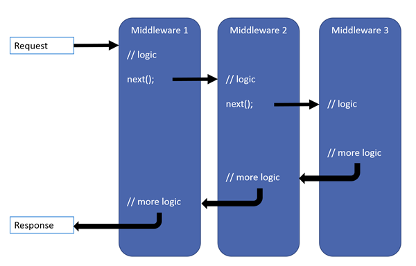
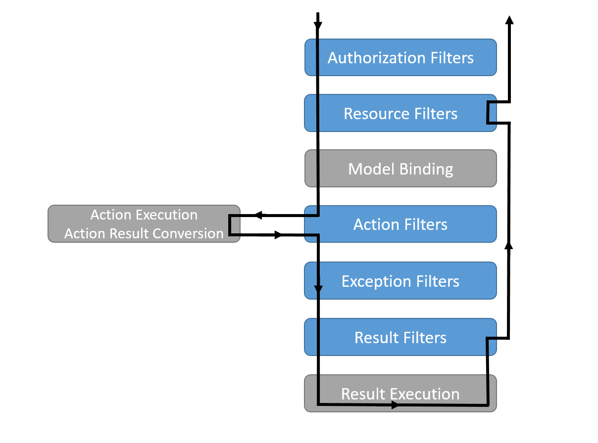

## 中间件和过滤器

### 1. 区别

- **中间件：**一般将一些跟业务无关的功能放到中间件中，如 打印web请求与响应日志、全局异常处理等。
- **过滤器：**更贴合业务，业务相关功能放到过滤器中，如 验证请求参数等。

### 2. 中间件

[官方文档：ASP.NET Core 中间件](https://docs.microsoft.com/zh-cn/aspnet/core/fundamentals/middleware/?view=aspnetcore-5.0)

#### 2.1 顺序

ASP.NET Core 请求管道包含一系列请求委托，依次调用。 下图演示了这一概念。 沿黑色箭头执行。

下图显示了 ASP.NET Core MVC 和 Razor Pages 应用的完整请求处理管道。 你可以在典型应用中了解现有中间件的顺序，以及在哪里添加自定义中间件。 你可以完全控制如何重新排列现有中间件，或根据场景需要注入新的自定义中间件。

### 3. 过滤器

[官方文档：ASP.NET Core 中的筛选器](https://docs.microsoft.com/zh-cn/aspnet/core/mvc/controllers/filters?view=aspnetcore-5.0)

#### 3.1 过滤器类型

> ASP.NET Core有以下5中筛选器类型，下表列出的接口仅有同步版本，异步版本在前面加`Async`(`IAsyncAuthorizationFilter`)即可。

| 过滤器类型                                                   | 接口                 | 默认实现              | 描述                                                         |
| ------------------------------------------------------------ | -------------------- | --------------------- | :----------------------------------------------------------- |
| [授权筛选器](https://docs.microsoft.com/zh-cn/aspnet/core/mvc/controllers/filters?view=aspnetcore-5.0#authorization-filters) | IAuthorizationFilter | AuthorizeAttribute    | 最先运行，用于确定是否已针对请求为用户授权。 如果请求未获授权，授权筛选器可以让管道短路。 |
| [资源筛选器](https://docs.microsoft.com/zh-cn/aspnet/core/mvc/controllers/filters?view=aspnetcore-5.0#resource-filters) | IResourceFilter      | -                     | 授权后运行。 [OnResourceExecuting](https://docs.microsoft.com/zh-cn/dotnet/api/microsoft.aspnetcore.mvc.filters.iresourcefilter.onresourceexecuting) 在筛选器管道的其余阶段之前运行代码。 例如，`OnResourceExecuting` 在模型绑定之前运行代码。 [OnResourceExecuted](https://docs.microsoft.com/zh-cn/dotnet/api/microsoft.aspnetcore.mvc.filters.iresourcefilter.onresourceexecuted) 在管道的其余阶段完成之后运行代码。 |
| [操作筛选器](https://docs.microsoft.com/zh-cn/aspnet/core/mvc/controllers/filters?view=aspnetcore-5.0#action-filters) | IActionFilter        | ActionFilterAttribute | 在调用操作方法之前和之后立即运行代码。 可以更改传递到操作中的参数。 可以更改从操作返回的结果。 Pages 中 Razor 不支持 。 |
| [异常筛选器](https://docs.microsoft.com/zh-cn/aspnet/core/mvc/controllers/filters?view=aspnetcore-5.0#exception-filters) | IExceptionFilter     | HandleErrorAttribute  | 在向响应正文写入任何内容之前，对未经处理的异常应用全局策略。 |
| [结果筛选器](https://docs.microsoft.com/zh-cn/aspnet/core/mvc/controllers/filters?view=aspnetcore-5.0#result-filters) | IResultFilter        | ActionFilterAttribute | 在执行操作结果之前和之后立即运行代码。 仅当操作方法成功执行时，它们才会运行。 |

#### 3.2 顺序

下图展示了筛选器类型在筛选器管道中的交互方式。

