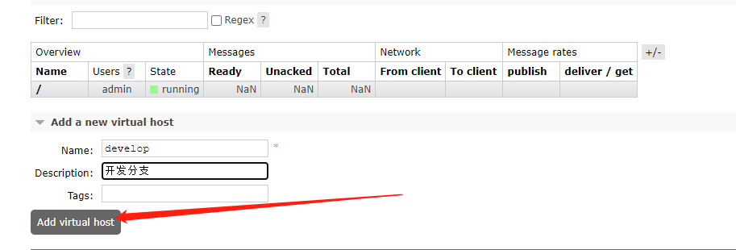

# 1 RabbitMQ简介

## 1.1 安装

### 1.1.1 docker方式

```bash
#15672端口为web管理端的端口，5672为RabbitMQ服务的端口
docker run -d  --name rabbitmq -e RABBITMQ_DEFAULT_USER=admin -e RABBITMQ_DEFAULT_PASS=123456 -p 15672:15672 -p 5672:5672 :3.9.11-management
```

### 1.1.2 docker-compose方式

```bash
version: '3'
services:
  rabbitmq:
    image: rabbitmq:3.9.11-management
    container_name: rabbitmq
    restart: always
    hostname: rabbitmq_host
    ports:
      - 15672:15672   # web UI 管理接口
      - 5672:5672	# 生产者和消费者连接使用的接口
    volumes:
      - ./log:/var/log/rabbitmq #挂载 RabbitMQ日志
      - ./data:/var/lib/rabbitmq #挂载 RabbitMQ数据
    environment:
      - RABBITMQ_DEFAULT_USER=admin
      - RABBITMQ_DEFAULT_PASS=123456
```

```bash
docker-compose up -d
```

__参数说明__

1. 15672：UI端使用端口
   5672：rabbitmq api 端口
   浏览器访问 ip:15672即可，输入用户名，密码登录。

2. 推荐为docker容器设置hostname，因为rabbitmq默认使用hostname作为存储数据的节点名，设置hostname可以避免生成随机的节点名，方便追踪数据。官网原文如下

> One of the important things to note about RabbitMQ is that it stores data based on what it calls the "Node Name", which defaults to the hostname. What this means for usage in Docker is that we should specify -h/--hostname explicitly for each daemon so that we don't get a random hostname and can keep track of our data:

3. RABBITMQ_DEFAULT_USER 和 RABBITMQ_DEFAULT_PASS
   用来设置超级管理员的账号和密码，如果不设置，默认都是 guest

4. docker镜像使用像这样 rabbitmq:3.8.3-management 带有后缀 -management的镜像，之前使用没带这个后缀的镜像，网页访问失败

### 1.1.3 安装后的校验和准备

- 浏览器输入 localhost:15672，进入web管理界面
- 建一个名为develop的Virtual host(虚拟主机)使用，项目中一般是一个项目建一个Virtual host用，能够隔离队列
- 
- 
- 

# 2 应用场景

## 2.1 异步处理

对于不是必须立刻处理的业务逻辑，可以通过消息队列做异步处理

## 2.2 应用解耦

解耦各个系统

## 2.3 流量削峰

控制并发处理量

# 3 RabbitMQ六种队列模式

安装 RabbitMQ.Client 6.2.2 Nuget包

## 3.1 简单队列

一个生产者发送消息到队列，一个消费者消费消息


- 建立一个获取RabbitMQ连接的类 `RH.RabbitMQHelper.cs`

- 生产者代码位于 `Producer`下的`SimpleQueue`项目
- 消费者代码位于`Consumer`下的`SimpleConsumer`项目
- 运行生产者代码后，会往队列发送10条消息
- 

- 运行消费者代码，消费完队列中的消息后，队列中消息变成了0条
- 

## 3.2 工作队列模式

一个消息生产者，一个交换器，一个消息队列，多个消费者。同样也称为点对点模式


生产者P发送消息到队列，多个消费者C消费队列的数据。

工作队列也称为**公平性队列模式，**循环分发，RabbitMQ 将按顺序将每条消息发送给下一个消费者，每个消费者将获得相同数量的消息。

- 生产者代码位于 `Producer`下的`WorkQueue`项目
- 消费者代码位于`Consumer`下的`WorkQueue`项目
- 执行生产者代码后，队列中有了10条数据，并且带有D持久化标识
- 

- 执行消费者代码时，可以看到队列有两个消费者，并且从控制台日志可以看出，10条数据被平均分配给了两个消费者
- 

## 3.3 发布订阅模式

Pulish/Subscribe，无选择接收消息，一个消息生产者，一个交换机（**交换机类型为fanout**），多个消息队列，多个消费者。称为发布/订阅模式

在应用中，只需要简单的将队列绑定到交换机上。一个发送到交换机的消息都会被转发到与该交换机绑定的所有队列上。很像子网广播，每台子网内的主机都获得了一份复制的消息。


生产者P只需把消息发送到交换机X，绑定这个交换机的队列都会获得一份一样的数据。

应用场景：适合于用同一份数据源做不同的业务。

- 生产者代码位于 `Producer`下的`PulishSubscribe`项目
- 消费者代码位于`Consumer`下的`PulishSubscribe`项目

- 运行生产者代码，向交换机发送10条消息，绑定这个交换机的3个队列都会有10条消息
- 

- 消费端的代码和工作队列的一样，只需知道队列名即可消费，声明时要和生产者的声明一样

## 3.4 路由模式（推荐）

在发布/订阅模式的基础上，有选择的接收消息，也就是通过 routing 路由进行匹配条件是否满足接收消息


上图是一个结合日志消费级别的配图，在路由模式它会把消息路由到那些 binding key 与 routing key 完全匹配的 Queue 中，此模式也就是 Exchange 模式中的**`direct`**模式。

 生产者P发送数据是要指定交换机(X）和routing发送消息 ，指定的routingKey=error，则队列Q1和队列Q2都会有一份数据，如果指定routingKey=into,或=warning，交换机(X)只会把消息发到Q2队列。

- 生产者代码位于 `Producer`下的`Route`项目
- 消费者代码位于`Consumer`下的`Route`项目
- 运行生产者代码后，查看RabbitMQ管理界面，direct_errorlog队列10条，而direct_alllog有20条，因为direct_alllog队列两个routingKey的消息都进去了。 点进去看下两个队列绑定的交换机和routingKey。
- 

- 

- 消费者和工作队列一样，只需根据队列名消费即可
- **普通场景中推荐使用路由模式，**因为路由模式有交换机，有路由key，能够更好的拓展各种应用场景。

## 3.5 主题模式

topics(主题)模式跟routing路由模式类似，只不过路由模式是指定固定的路由键 routingKey，而主题模式是可以模糊匹配路由键 routingKey，类似于SQL中 = 和 like 的关系。


P 表示为生产者、 X 表示交换机、C1C2 表示为消费者，红色表示队列。

 topics 模式与 routing 模式比较相近，topics 模式不能具有任意的 routingKey，必须由一个英文句点号“.”分隔的字符串（我们将被句点号“.”分隔开的每一段独立的字符串称为一个单词），比如 "lazy.orange.a"。topics routingKey 中可以存在两种特殊字符`"*"`与`"#"`，用于做模糊匹配，其中“*”用于匹配一个单词，“#”用于匹配多个单词（可以是零个）。

以上图为例：

如果发送消息的routingKey设置为：

aaa.orange.rabbit，那么消息会路由到Q1与Q2，

routingKey=aaa.orange.bb的消息会路由到Q1，

routingKey=lazy.aa.bb.cc的消息会路由到Q2；

routingKey=lazy.aa.rabbit的消息会路由到 Q2（只会投递给Q2一次，虽然这个routingKey 与 Q2 的两个 bindingKey 都匹配）；

没匹配routingKey的消息将会被丢弃。

- 生产者代码位于 `Producer`下的`Topics`项目
- 消费者代码位于`Consumer`下的`Topics`项目
- 执行生产者代码后看rabbitMQ界面
- 

## 3.6 RPC模式

与上面其他5种所不同之处，该模式是拥有请求/回复的。也就是有响应的，上面5种都没有。

RPC是指远程过程调用，也就是说两台服务器A，B，一个应用部署在A服务器上，想要调用B服务器上应用提供的处理业务，处理完后然后在A服务器继续执行下去，把异步的消息以同步的方式执行。


 客户端(C)声明一个排他队列自己订阅，然后发送消息到RPC队列同时也把这个排他队列名也在消息里传进去，服务端监听RPC队列，处理完业务后把处理结果发送到这个排他队列，然后客户端收到结果，继续处理自己的逻辑。

RPC的处理流程：

- 当客户端启动时，创建一个匿名的回调队列。
- 客户端为RPC请求设置2个属性：replyTo：设置回调队列名字；correlationId：标记request。
- 请求被发送到rpc_queue队列中。
- RPC服务器端监听rpc_queue队列中的请求，当请求到来时，服务器端会处理并且把带有结果的消息发送给客户端。接收的队列就是replyTo设定的回调队列。
- 客户端监听回调队列，当有消息时，检查correlationId属性，如果与request中匹配，那就是结果了。

1. 服务端代码

   ```C#
   public class RPCServer
       {
           public static void RpcHandle()
           {
               var connection = RabbitMQHelper.GetConnection();
               {
                   var channel = connection.CreateModel();
                   {
                       string queueName = "rpc_queue";
                       channel.QueueDeclare(queue: queueName, durable: false,
                         exclusive: false, autoDelete: false, arguments: null);
                       channel.BasicQos(0, 1, false);
                       var consumer = new EventingBasicConsumer(channel);
                       channel.BasicConsume(queue: queueName,
                         autoAck: false, consumer: consumer);
                       Console.WriteLine("【服务端】等待RPC请求...");
   
                       consumer.Received += (model, ea) =>
                       {
                           string response = null;
   
                           var body = ea.Body.ToArray();
                           var props = ea.BasicProperties;
                           var replyProps = channel.CreateBasicProperties();
                           replyProps.CorrelationId = props.CorrelationId;
   
                           try
                           {
                               var message = Encoding.UTF8.GetString(body);
                               Console.WriteLine($"【服务端】接收到数据:{ message},开始处理");
                               response = $"消息:{message},处理完成";
                           }
                           catch (Exception e)
                           {
                               Console.WriteLine("错误:" + e.Message);
                               response = "";
                           }
                           finally
                           {
                               var responseBytes = Encoding.UTF8.GetBytes(response);
                               channel.BasicPublish(exchange: "", routingKey: props.ReplyTo,
                                 basicProperties: replyProps, body: responseBytes);
                               channel.BasicAck(deliveryTag: ea.DeliveryTag,
                                 multiple: false);
                           }
                       };
                   }
               }
           }
       }
   ```

2. 客户端代码

   ```C#
   public class RPCClient
       {
           private readonly IConnection connection;
           private readonly IModel channel;
           private readonly string replyQueueName;
           private readonly EventingBasicConsumer consumer;
           private readonly BlockingCollection<string> respQueue = new BlockingCollection<string>();
           private readonly IBasicProperties props;
   
           public RPCClient()
           {
               connection = RabbitMQHelper.GetConnection();
   
               channel = connection.CreateModel();
               replyQueueName = channel.QueueDeclare().QueueName;
               consumer = new EventingBasicConsumer(channel);
   
               props = channel.CreateBasicProperties();
               var correlationId = Guid.NewGuid().ToString();
               props.CorrelationId = correlationId; //给消息id
               props.ReplyTo = replyQueueName;//回调的队列名，Client关闭后会自动删除
   
               consumer.Received += (model, ea) =>
               {
                   var body = ea.Body.ToArray();
                   var response = Encoding.UTF8.GetString(body);
                   //监听的消息Id和定义的消息Id相同代表这条消息服务端处理完成
                   if (ea.BasicProperties.CorrelationId == correlationId)
                   {
                       respQueue.Add(response);
                   }
               };
   
               channel.BasicConsume(
                   consumer: consumer,
                   queue: replyQueueName,
                   autoAck: true);
           }
   
           public string Call(string message)
           {
               var messageBytes = Encoding.UTF8.GetBytes(message);
               //发送消息
               channel.BasicPublish(
                   exchange: "",
                   routingKey: "rpc_queue",
                   basicProperties: props,
                   body: messageBytes);
               //等待回复
               return respQueue.Take();
           }
   
           public void Close()
           {
               connection.Close();
           }
       }
   ```

3. 执行代码

   ```C#
   static void Main(string[] args)
           {
               Console.WriteLine("Hello World!");
               //启动服务端，正常逻辑是在另一个程序
               RPCServer.RpcHandle();
               //实例化客户端
               var rpcClient = new RPCClient();
               string message = $"消息id:{new Random().Next(1, 1000)}";
               Console.WriteLine($"【客服端】RPC请求中，{message}");
               //向服务端发送消息，等待回复
               var response = rpcClient.Call(message);
               Console.WriteLine("【客服端】收到回复响应:{0}", response);
               rpcClient.Close();
               Console.ReadKey();
           }
   ```
   

## 3.7 总结

以上便是RabbitMQ的6中模式在.net core中实际使用，其中(1)简单队列，(2)工作队列,(4)路由模式,(6)RPC模式的交换机类型都是direct，(3)发布订阅的交换机是fanout，(5)topics的交换机是topic。正常场景用的是direct，默认交换机也是direct类型的，**推荐用(4)路由模式，**因为指定交换机名比起默认的交换机会容易扩展场景，其他的交换机看业务场景所需使用**。**

下面位置可以看到交换机类型，amq.开头那几个是内置的，避免交换机过多可以直接使用。

   
