# MySQL数据库

# 一、引言

------

## 1.1 现有的数据存储方式有哪些？

- Java程序存储数据（变量、对象、数组、集合），数据保存在内存中，属于瞬时状态存储。
- 文件（File）存储数据，保存在硬盘上，属于持久状态存储。

## 1.2 以上存储方式存在哪些缺点？

- 没有数据类型的区分。
- 存储数据量极小。
- 没有安全访问限制。
- 没有备份、恢复机制。


# 二、数据库

------

## 2.1 概念

 数据库是按照数据接口来**组织**、**存储和管理数据的仓库**。是一个长期存储在计算机内的、有组织的、有共享的、统一管理的数据集合。

## 2.2 数据库的分类

- 网状结构数据库：美国通用电气公司IDS（Integrated Data Store），以节点形式存储和访问。
- 层次结构数据库：IBM公司IMS（Information Management System）定向有序的树状结构实现存储和访问。
- 关系结构数据库：Oracle、DB2、MySQL、SQL Server，以表格（Table）存储，多表间建立关联关系，通过分类、合并、连接、选取等运算实现访问。
- 非关系型数据库：ElastecSearch、MongoDB、Redis，多数使用哈希表，表中以键值（key-value）的方式实现特定的键和一个指针指向的特定数据。

# 三、数据库管理系统

------

## 3.1 概念

 **数据库管理系统**（DataBase Management System，DBMS）：指一种操作和管理数据库的大型软件，用于建立、使用、和维护数据库，对数据库进行统一管理和控制，以保证数据库的安全性和完整性。用户通过数据库管理系统访问数据库中的数据。

## 3.2 常见数据库管理系统

- Oracle：被认为是业界目前比较成功的关系型数据库管理系统。Oracle数据库可以运行在UNIX、Windows等主流操作平台，完全支持所有的工业标准，并获得最高级别的ISO标准安全性认证。
- DB2：IBM公司的产品，DB2数据库采用多进程多线索体系结构，其功能足以满足大中公司的需求，并可灵活地服务于中小型电子商务解决方案。
- SQL Server： Microsoft公司退出的关系型数据库管理系统。具有使用方便可伸缩性好与相关软件集成程度高等优点。
- SQLLite：应用在手机端的数据库。

# 四、MySQL

------

## 4.1 简介

 MySQL是一个**关系型数据库管理系统**，由瑞典MySQL AB公司开发，属于Oracle旗下产品。MySQL是最流行的关系型数据库管理系统之一，在WEB应用方面，MySQL是最好RDBM（Relational Database Management System，关系型数据库管理系统）应用软件之一。

## 4.2 访问与下载

官网地址： https://www.mysql.com/

下载地址： https://dev.mysql.com/downloads/mysql/

安装过程略，我个人下载的是MySQL5.7版本，也不建议下载最新的8.x版本。

## 4.3 卸载

- 控制台卸载。
- 找到mysql的安装目录进行删除。
- programdata删除mysql。

> - 如果卸载后，有未删除的MySQL服务，可采用手动删除。
> - 以管理员身份打开命令行，输入`sc delete MySQL57`，回车。

如果某个MySQL组件无法删除，可以尝试从注册表搜索信息删除相关文件夹。具体可百度。

## 4.4 配置环境变量

**Windows**

- 创建MYSQL_HOME: `C:\Program Files\MySQL\MySQL Server5.7`
- 追加PATH: `%MYSQL_HOME%\bin;`

## 4.5 MySQL目录结构

核心文件介绍：

| 文件夹名称 | 内容               |
| ---------- | ------------------ |
| bin        | 命令文件           |
| lib        | 库文件             |
| include    | 头文件             |
| Share      | 字符集、语言等信息 |

## 4.6 MySQL配置文件

在MySQL安装目录中找到my.ini文件，并打开my.ini文件查看几个常用配置参数。

| 参数                   | 描述                     |
| ---------------------- | ------------------------ |
| default-character-set  | 客户端默认字符集         |
| character-set-server   | 服务器端默认字符集       |
| port                   | 客户端和服务器端的端口号 |
| default-storage-engine | MySQL默认存储引擎INNODB  |

通过安装程序安装的MySQL配置文件在C盘的隐藏文件ProgramData中，点进去找到对应的MYSQL目录就能看到my.ini文件了。

客户端默认字符集和服务器端默认字符集必须保持一致，它们在初始的配置文件中都是被注释掉的，那么默认的字符集会跟随你的系统默认字符集。

# 五、SQL语言

------

## 5.1 概念

 SQL（Structured Query Language）结构化查询语言，用于存储数据、更新、查询和管理关系数据库系统的程序设计语言。

- **经验**：通常执行对数据库的“增删改查”，简称**C**（Create）**R**（Read）**U**（Update）**D**（Delete）。

## 5.2 MySQL应用

对于数据库操作，需要在**进入MySQL环境下**进行指令输入，并在一句指令的末尾**使用 ;** 结束。 ·

## 5.3 基本命令

- **登录数据库系统**：`mysql -u root -p password`

  root和password分别写自己设置的用户名和密码，用户名默认是root。该方式登录数据库系统会有一个warning提示你正在明文登录。

  **你可以分别填写用户名和密码**：`mysql -u root -p`

  回车之后命令行会提示你输入密码，此时的密码是密文形式。

- **查看MySQL中所有数据库**：`SHOW DATABASES;`

  显示当前MySQL中包含的所有数据库。

  

  命令行中出现了一个表结构，表头是数据库的意思，里面存放了安装MySQL之后就默认存在的6个数据库。

  | 数据库名称         | 描述                                                         |
  | ------------------ | ------------------------------------------------------------ |
  | information_schema | 信息数据库，其中保存着关于所有数据库的信息（元数据）。 元数据是关于数据的数据，如数据库名或表名，列的数据类型，或访问权限等。 |
  | mysql              | 核心数据库，主要负责存储数据库的用户、权限设置、关键字等。 以及需要使用的控制和管理信息，不可以删除。 |
  | performance_schema | 性能优化的数据库，MySQL5.5版本中新增的一个性能优化的引擎。   |
  | sys                | 系统数据库，MySQL5.7版本中新增的可以快速地了解元数据库信息的系统库， 便于发现数据库的多样信息，解决性能瓶颈问题。 |

  sakila数据库是一个样板数据库； world数据库存放了一些国家对应的编号信息。这些数据库都是MySQL默认提供的**系统数据库**，我们不必去关注，也不要想着哪些可以删。

  > SQL 的关键字和函数名不区分大小写，SELEC、select或者sElEcT都是等价的；
  >
  > MySQL用服务器主机的底层文件系统所包含的目录和文件来表示数据库和表。因此，数据库名和表名的默认大小写取决于服务器主机的操作系统在命名方面的规定。比如 Windows 系统的文件名不区分大小写，所以**运行在 Windows 系统上面的 MySQL 服务器也不用区分数据库名和表名的大小写**。Linux 系统的文件名区分大小写，所以运**行在 Linux 系统上的 MySQL 服务器需要区分数据库名和表名的大小写**。对于 Mac OS X 平台，其文件系统中的名字是个例外，它们不区分大小写。
  >
  > 在 Linux 服务器下创建数据库和表时，应该认真考虑大小写的问题，比如它们以后**是否会迁移**到 Windows 服务器上。
  >
  > 在阿里巴巴 Java 开发手册的 MySql 建表规约里提到：
  >
  > > 【强制】表名、字段名必须使用小写字母或数字，禁止出现数字开头，禁止两个下划线中间只出现数字。数据库字段名的修改代价很大，因为无法进行预发布，所以字段名称需要慎重考虑。
  >
  > 一般建议统一使用小写字母，并且 InnoDB 引擎在其内部都是以小写字母方式来存储数据库名和表名的。这样可以有效的防止 MySQL 产生大小写问题。

- **创建自定义数据库**：

  `CREATE DATABASE dbname;`创建数据库，dbname为数据库名；

  `CREATE DATEBASE dbname2 CHARACTER SET gbk;`创建数据库并设置编码；

  `CREATE DATABASE IF NOT EXISTS dbname3;`输入数据库dbname3不存在则创建。

- **查看数据库创建信息**：

  `SHOW CREATE DATABASE dbname;`查看创建数据库时的基本信息。

  

  命令行中显示了一个表，在Create Datebase列中显示了建数据库时的语句，后面的注释说明了默认的字符集格式，Latin1是ISO-8859-1的别名，有些环境下写作Latin-1。

- **修改数据库**：

  `ALTER DATABASE dbname CHARACTER SET utf8;`修改数据库字符集编码格式为utf-8。

- **删除数据库**：

  `DROP DATABASE dbname;`删除数据库dbname。

  

  查看数据库，发现创建的dbname数据库已经被删除了。

- **查看当前所使用的的数据库**：

  `SELECT DATABASE();`查看当前所使用/操作的数据库。如果当前没有使用任何数据库则会显示NULL。

- **使用数据库**：

  `USE dbname;`使用dbname数据库。

  

  重新创建数据库，查看当前操作的数据库，显示NULL；使用USE关键字操作数据库dbname，再进行查看，发现显示了当前使用的dbname数据库，那么接下来的种种操作就是对该数据库的操作。

# 六、客户端工具

------

在使用命令行对数据库进行操作时，你会发现有很多弊端或者说麻烦的地方。比如命令行不能对自己的语法提前进行校验，需要在回车之后看到结果；输入的时候没有语法提示，编写速度慢等。如同JAVA编写所使用的IDE，MySQL也有相应的数据库管理工具，提供了便利的可视化操作。

## 6.1 Navicate

**Navicate是一套快速**、**可靠并价格相宜的数据库管理工具**，**专为简化数据库的管理及降低系统管理成本而设**。它的设计符合数据库管理员、开发人员及中小企业的需要。Navicate是以直觉化的图形用户界面而建的，让你可以安全并且以简单的方式创建、组织、访问和共用信息。

如果经济实力不允许，网络上也有破解版/注册码工具等，可以自行百度下载。

## 6.2 SQLyog

MySQL可能是世界上最流行的开源数据库引擎，但是使用基于文本的工具和配置文件可能很难进行管理。SQLyog提供了完整的图形界面，即使初学者也可以轻松使用MySQL的强大功能。其拥有广泛的预定义工具和查询、友好的视觉界面、类似Excel的查询界面编辑界面等优点。

SQLyog软件界面友好，适合初学者。

# 七、数据查询

------

打开你下载的客户端工具，新建查询，创建一个字符集格式为utf8的数据库companydb。**这里有一个已经写好的SQL代码**。右键选中该数据库，选择 运行SQL文件，在弹出的窗口中导入SQL文件后执行，再刷新一下数据库就发现数据库中已经有了一些表数据。

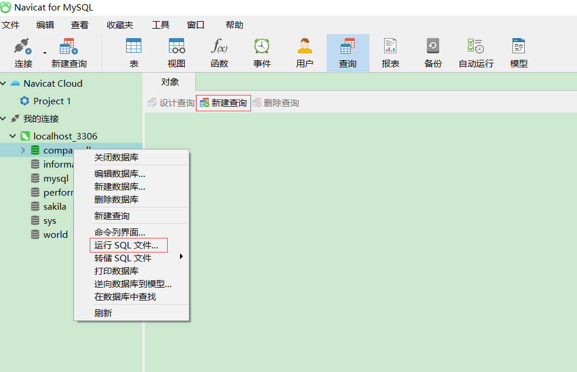

> 链接: https://pan.baidu.com/s/1zzIRe3YnziHkawflZ_3BTQ
>
> 提取码: 7d3e

**相关的SQL文件自行下载**，**接下来的操作都会在这个数据库中执行**。

## 7.1 数据库表的基本结构

关系结构数据库是以表格（Table）进行数据存储，表格由“行”和”列“组成。

- **经验**：**执行查询语句返回的结果是一张虚拟表**。

## 7.2 基本查询

**语法**：`SELECT 列名 FROM 表名`

| 关键字 | 描述           |
| ------ | -------------- |
| SELECT | 指定要查询的列 |
| FROM   | 指定要查询的表 |

### 7.2.1 查询部分列

```
COPY#查询员工表中所有员工的编号、名字、邮箱
SELECT EMPLOYEE_ID,FIRST_NAME,EMAIL FROM t_employees;
```

### 7.2.2 查询所有列

```
COPY#查询员工表中员工的所有信息（所有列）
SELECT 所有列的列名 FROM t_employees;
SELECT * FROM t_employees;
```

- **注意**：**生产环境下**，**优先使用列名查询**，***的方式需转换成全列名**，**效率低**，**可读性差**。

### 7.2.3 对列中的数据进行运算

```
COPY#查询员工表中所有员工的编号、名字、年薪
SELECT EMPLOYEE_ID,FIRST_NAME,SALARY*12 FROM t_employees;
```

对数据列进行运算，该列需要是一个**数值列**，而不是字符串列等。

执行完该查询语句后，返回的虚拟表中可以看见运算后的“年薪”列SALARY*12：

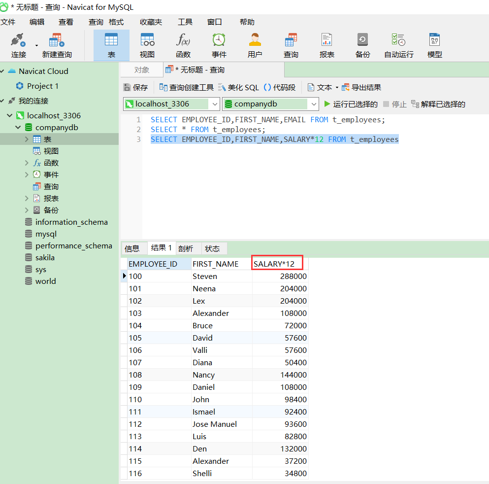

| 算数运算符 | 描述           |
| ---------- | -------------- |
| +          | 两列做加法运算 |
| -          | 两列做减法运算 |
| *          | 两列做乘法运算 |
| /          | 两列做除法运算 |

- **注意**：**%是占位符**，**而非模运算符**。

### 7.2.4 列的别名

在上图中查询结果的列名可能并不直观，比如SALARY*12，它应当被显示为“年薪”才更符合所期望看到的查询结果，我们可以在查询的时候为列名取一个别名，使表数据更加清晰明了。

**语法**：`列 AS '列名'`

```
COPY#查询员工表中所有员工的编号、名字、年薪（列名均为中文）
SELECT EMPLOYEE_ID AS '员工编号',FIRST_NAME AS '姓氏',SALARY*12 AS '年薪' 
FROM t_employees;
```

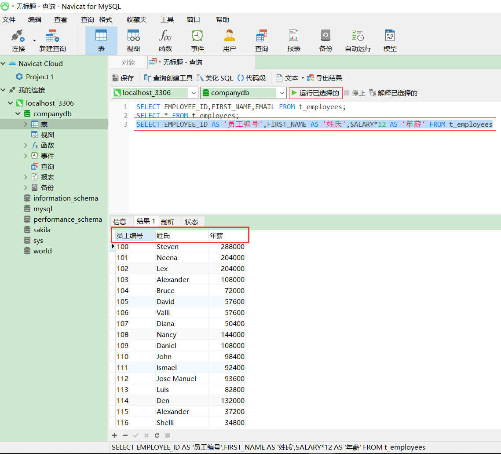

### 7.2.5 查询结果去重

员工表中每个员工都对应着一个经理ID，但这些ID有可能重复，因为多个员工可能对应着同一个经理ID，当需要查询员工表中对应了多少个经理ID时，只查询列名就可能出现相同的ID数据，这时候就需要将查询结果去重。

**语法**：`DISTINCT 列名`

```
COPY#查询员工表中所有经理的ID
SELECT DISTINCT MANAGER_ID FROM t_employees;
```

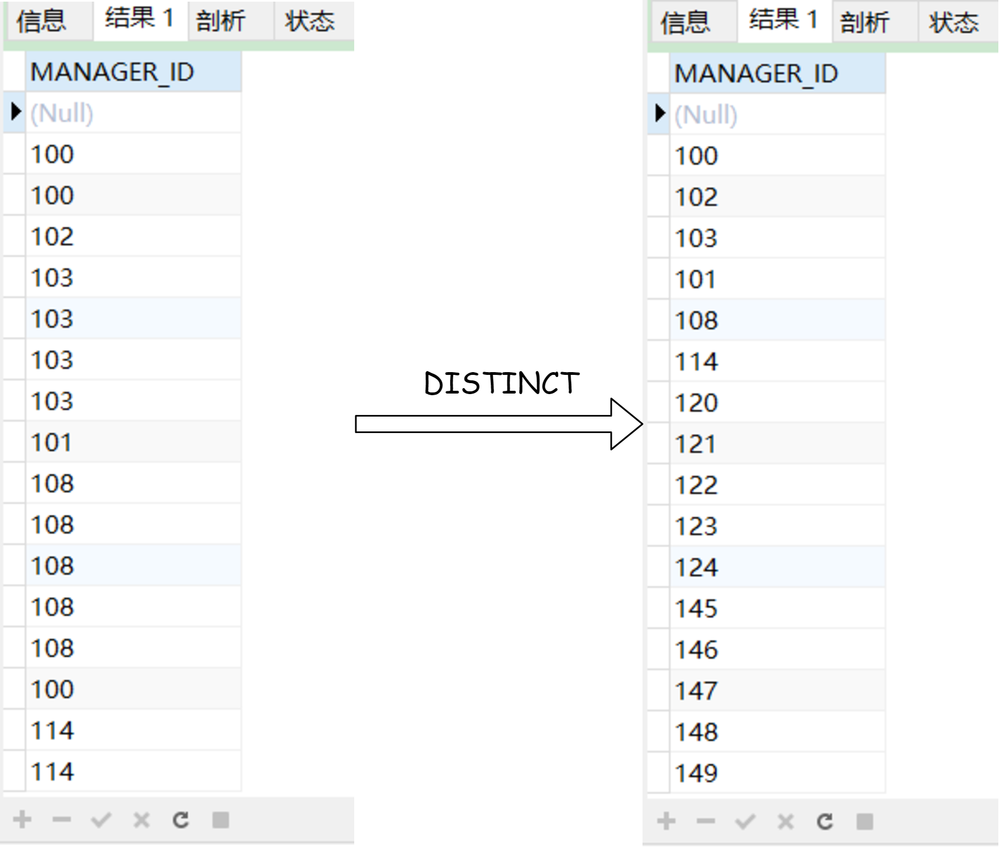

## 7.3 排序查询

**语法**：`SELECT 列名 FROM 表名 ORDER BY 排序列[排序规则]`括号内可省略。

| 排序规则 | 描述                   |
| -------- | ---------------------- |
| ASC      | 对前面排序列做升序排序 |
| DESC     | 对前面排序列做降序排序 |

### 7.3.1 依据单列排序

```
COPY#查询员工的编号，名字，薪资，按工资高低进行降序排序
SELECT EMPLOYEE_ID,FIRST_NAME,SALARY FROM t_employees ORDER BY SALARY DESC;
```

如果salary的排序出现问题，可以通过`DESC t_employees`来查看一下员工表中salary的数据类型，如果是字符串类型就修改成整型，或者查询语句中将salary改成`salary+0`即可。

### 7.3.2 依据多列排序

```
COPY#查询员工的编号，名字，薪资。按工资高低进行升序排序（薪资相同，按照编号降序排序）
SELECT EMPLOYEE_ID,FIRST_NAME,SALARY 
FROM t_employees ORDER BY SALARY ASC,EMPLOYEE_ID DESC;
```

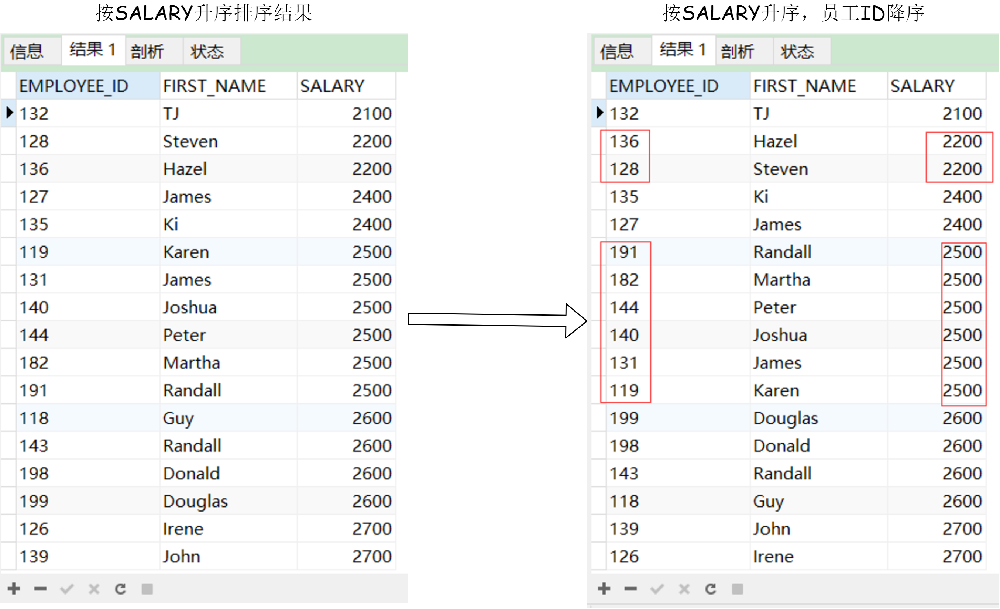

排序时的比较顺序为先按第一个字段SALARY进行比较排序，**如果相同**再按EMPLOYEE_ID比较排序。

## 7.4 条件查询

**语法**：`SELECT 列名 FROM 表名 WHERE 条件`

| 关键字    | 描述                                                   |
| --------- | ------------------------------------------------------ |
| WHERE条件 | 在查询结果中，筛选符合条件的查询结果，条件为布尔表达式 |

### 7.4.1 等值判断（=）

```
COPY#查询薪资是11000的员工信息（编号、名字、薪资）
SELECT EMPLOYEE_ID,FIRST_NAME,SALARY FROM t_employees WHERE SALARY = 11000;
```

- **注意**：与java不同（==），mysql中等值判断使用 = 。

### 7.4.2 逻辑判断（and、or、not）

```
COPY#查询薪资是11000并且提成是0.30的员工信息（编号、名字、薪资）
SELECT EMPLOYEE_ID,FIRST_NAME,SALARY 
FROM t_employees WHERE SALARY = 11000 AND COMMISSION_PCT = 0.30;
```

OR和NOT的使用方法同AND，NOT就是非，NOT后跟条件，查询的是条件取反的结果集，不再演示，自行操练。

### 7.4.3 不等值判断（>、>、>=、<=、!=、<>）

```
COPY#查询员工的薪资在6000~10000之间的员工信息（编号、名字、薪资）
SELECT EMPLOYEE_ID,FIRST_NAME,SALARY 
FROM t_employees WHERE SALARY >= 6000 AND SALARY <= 10000;
```

!=和<>都是不等于的含义。

### 7.4.4 区间判断

```
COPY#查询员工的薪资在6000~10000之间的员工信息（编号、名字、薪资）
SELECT EMPLOYEE_ID,FIRST_NAME,SALARY 
FROM t_employees WHERE SALARY BETWEEN 6000 AND 10000;
```

查询结果同上一节，区别在于上一节中有两个条件，必须同时满足，而区间判断是一个条件，在该区间中进行筛选。**在区间判断语法中**，**小值在前**，**大值在后**，**反之**，**得不到正确结果**。

### 7.4.5 NULL值判断

**语法**：`列名 IS NULL`或者`列名 IS NOT NULL`

```
COPY#查询没有提成的员工信息（编号，名字，薪资，提成）
SELECT EMPLOYEE_ID,FIRST_NAME,SALARY,COMMISSION_PCT 
FROM t_employees WHERE COMMISSION_PCT IS NULL;
```

### 7.4.6 枚举查询（IN(值1,值,值3)）

```
COPY#查询部门编号为70、80、90的员工信息（编号，名字，薪资，部门编号）
SELECT EMPLOYEE_ID,FIRST_NAME,SALARY,DEPARTMENT_ID 
FROM t_employees WHERE DEPARTMENT_ID IN (70,80,90);
```

**注意**：**IN的查询效率较低**，**可通过多条件拼接**。

### 7.4.7 模糊查询

**语法**：

- `列名 LIKE '唐_'`下横线表示匹配**单个**任意字符；
- `列名 LIKE '唐%'`百分号表示匹配**任意长度**的字符串。
- **模糊查询只能和LIKE关键字结合查询**。

```
COPY#查询名字以L开头的员工信息（编号、名字、薪资、部门编号）
SELECT EMPLOYEE_ID,FIRST_NAME,SALARY,DEPARTMENT_ID 
FROM t_employees WHERE FIRST_NAME LIKE 'L%'
```

### 7.4.8 分支结构查询

```
COPYCASE
	WHEN 条件1 THEN 结果1
	WHEN 条件2 THEN 结果2
	WHEN 条件3 THEN 结果3
	ELSE 结果
END
```

- **注意**：**通过使用CASE END进行条件判断**，**每条数据对应生成一个值**。
- **经验**：类似JAVA中的switch。

```
COPY#查询员工信息（编号、名字、薪资、薪资级别<对应条件表达式生成>）
SELECT EMPLOYEE_ID,FIRST_NAME,SALARY,DEPARTMENT_ID,
CASE 
	WHEN SALARY>=10000 THEN 'A'
	WHEN SALARY>=8000 AND SALARY<10000 THEN 'B'
	WHEN SALARY>=6000 AND SALARY<8000 THEN 'C'
	WHEN SALARY>=4000 AND SALARY<6000 THEN 'D'
	ELSE 'E'
END AS '薪资级别' FROM t_employees;
```

CASE中判断的每一个SALARY数据都会生成对应的一个值，在返回的虚拟表中其集合单独作为一列，但列名为整个CASE体中的查询语句，为了查询结果的直观性，可以为CASE体取一个别名“薪资级别”。

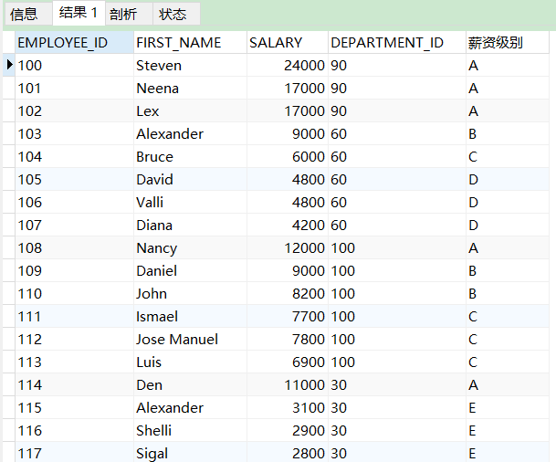

## 7.5 时间查询

时间查询都是调用的函数，所以会有参数列表，函数名后加括号。

语法：`SELECT 时间函数([参数列表])`

- **经验**：**执行时间函数查询**，**会自动生成一张虚表**（**一行一列**）

| 时间函数              | 描述                                   |
| --------------------- | -------------------------------------- |
| SYSDATE()             | 当前系统时间（日、月、年、时、分、秒） |
| CURDATE()             | 获取当前日期                           |
| CURTIME()             | 获取当前时间                           |
| WEEK(DATE)            | 获取指定日期为一年中的第几周           |
| YEAR(DATE)            | 获取指定时间的年份                     |
| HOUR(TIME)            | 获取指定时间的小时值                   |
| MINUTE(TIME)          | 获取指定时间的分钟值                   |
| DATEDIFF(DATE1,DATE2) | 获取DATE1和DATE2之间相隔的天数         |
| ADDDATE(DATE,N)       | 计算DATE加锁N天后的日期                |

```
COPY#查询当前时间
SELECT SYSDATE();
COPY#查询当前时间
SELECT NOW();
COPY#获取当前日期
SELECT CURDATE();
COPY#获取当前时间
SELECT CURTIME();
```

## 7.6 字符串查询

语法：`SELECT 字符串函数([参数列表])`

| 字符串函数                  | 说明                                             |
| --------------------------- | ------------------------------------------------ |
| CONCAT(str1,str2,…)         | 将多个字符串连接                                 |
| INSERT(str,post,len,newStr) | 将str中指定post位置开始len长度的内容替换为newStr |
| LOWER(str)                  | 将指定字符串转换为小写                           |
| UPPER(str)                  | 将指定字符串转换为大写                           |
| SUBSTRING(str,num.len)      | 将str字符串指定num位置开始截取len个内容          |

不同于JAVA，插入函数中post**下标从1开始**，比如这句话中下标为1的位置为“比”而不是“如”。

### 7.6.1 字符串应用

```
COPY#拼接内容
SELECT CONCAT('My','SQ','L');
#MYSQL
COPY#字符串替换
SELECT INSERT('这是什么数据库',3,2,'MySQL');
#这是MYSQL数据库
COPY#指定内容转换为小写
SELECT LOWER('MYSQL');
#mysql
COPY#指定内容转换为大写
SELECT UPPER('mysql');
#MYSQL
COPY#指定内容截取
SELECT SUBSTRING('JAVAMYSQLORACLE',5,5);
#MYSQL
```

## 7.7 聚合函数

聚合函数是对列进行操作的函数。

语法：`SELECT 聚合函数(列名) FROM 表名;`

- **经验**：**对多条数据的单列进行统计**，**返回统计后的一行结果**。

| 聚合函数 | 说明                     |
| -------- | ------------------------ |
| SUM()    | 求所有行中单列结果的总和 |
| AVG()    | 平均值                   |
| MAX()    | 最大值                   |
| MIN()    | 最小值                   |
| COUNT()  | 求总行数                 |

### 7.7.1 单列总和

```
COPY#统计所有员工每月的工资总和
SELECT SUM(SALARY) FROM t_employees;
```

### 7.7.2 单列平均值

```
COPY#统计所有员工每月的平均工资
SELECT AVG(SALARY) FROM t_employees;
```

### 7.7.3 单列最大值

```
COPY#统计所有员工中月薪最高的工资
SELECT MAX(SALARY) FROM t_employees;
```

### 7.7.4 单列最小值

```
COPY#统计所有员工中月薪最低的工资
SELECT MIN(SALARY) FROM t_employees;
```

### 7.7.5 总行数

```
COPY#统计员工总数
SELECT COUNT(*) FROM t_employees;#107
SELECT COUNT(EMPLOYEE_ID) FROM t_employees;#107
COPY#统计有提成的员工人数
SELECT COUNT(COMMISSION_PCT) FROM t_employees;#35
```

因为提成列COMMISSION_PCT有NULL值，所以在根据列名统计表总行数时会比实际的表总行数会少很多，这个数字表名了拥有提成的员工数量。

- 注意：聚合函数自动忽略NULL值，不进行统计。

## 7.8 分组查询

语法：`SELECT 列名 FROM 表名 WHERE 条件 GROUP BY 分组依据(列);`

| 关键字   | 说明                          |
| -------- | ----------------------------- |
| GROUP BY | 分组依据，必须在WHERE之后生效 |

### 7.8.1 查询各部门的总人数

```
COPY#思路
#1.按照部门编号进行分组（DEPARTMENT_ID）
#2.再针对各部门的人数进行统计（COUNT）
SELECT DEPARTMENT_ID,COUNT(EMPLOYEE_ID) 
FROM t_employees GROUP BY DEPARTMENT_ID;
```

### 7.8.2 查询各部门的平均工资

```
COPY#思路
#1.按照部门编号进行分组（分组依据DEPARTMENT_ID）
#2.针对每个部门进行平均工资统计。
SELECT DEPARTMENT_ID,AVG(SALARY) 
FROM t_employees GROUP BY DEPARTMENT_ID;
```

上两节的查询结果演示：

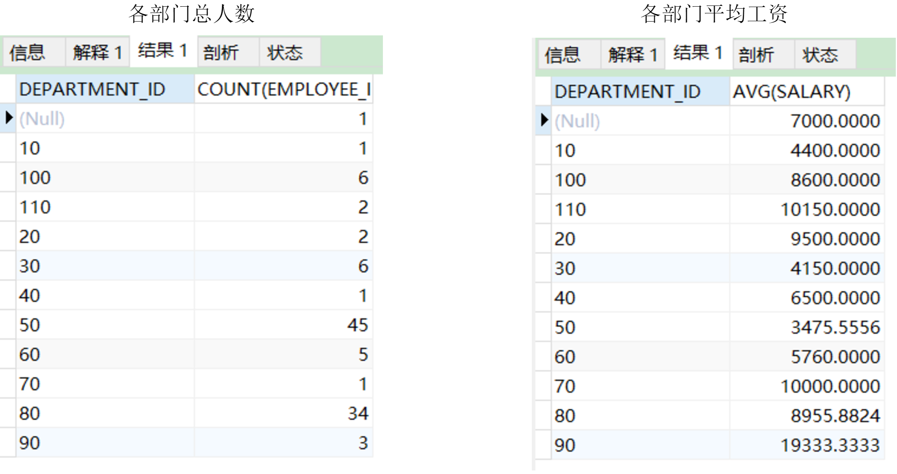

### 7.8.3 查询各个部门、各个岗位的人数

```
COPY#思路
#1.按照部门编号进行分组（分组依据）
#2.按照岗位名称进行分组
#3.针对每个部门中的每个岗位进行人数统计
SELECT DEPARTMENT_ID,JOB_ID,COUNT(EMPLOYEE_ID) 
FROM t_employees GROUP BY DEPARTMENT_ID,JOB_ID;
```

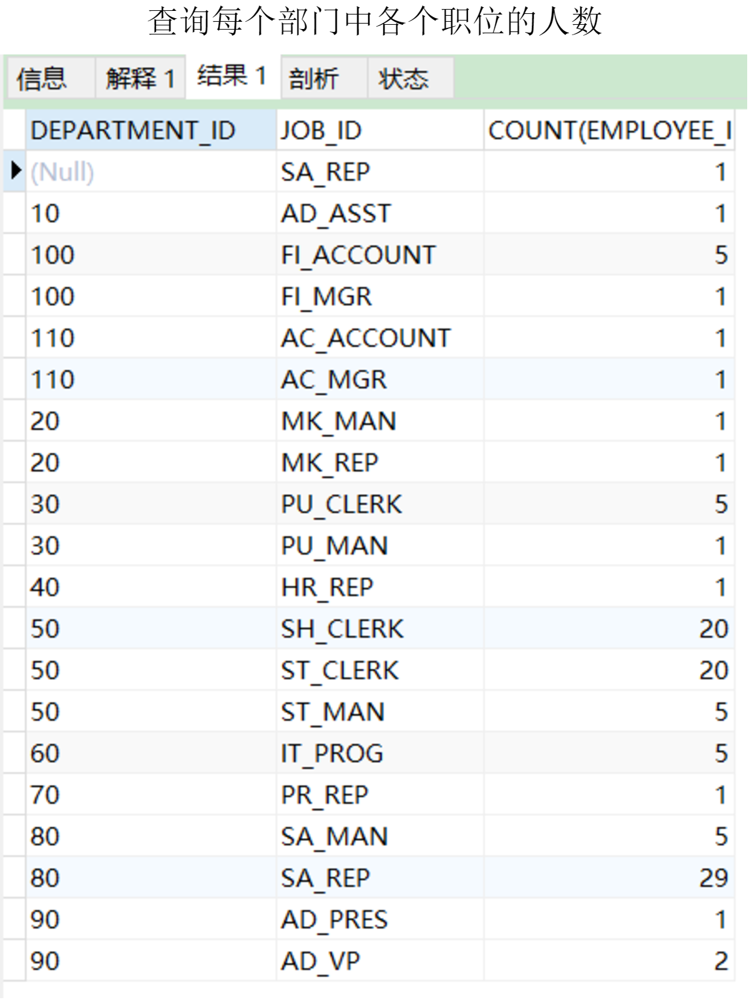

### 7.8.4 常见问题

```
COPY#查询各个部门id、总人数、first_name
SELECT DEPARTMENT_ID,COUNT(*),FIRST_NAME 
FROM t_employees GROUP BY DEPARTMENT_ID;
```

返回的虚拟表中，前两列是对应的，而第三列一个名字无法对应第二列中多个人数。

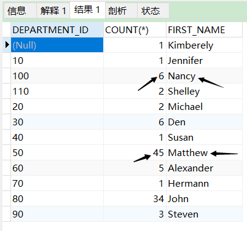

**分组查询中**，**SELECT选择的列只能是分组依据**，**或者聚合函数列**，**不能出现其他列**。

## 7.9 分组过滤查询

语法：`SELECT 列名 FROM 表名 WHERE 条件 GROUNP BY 分组列 HAVING 过滤规则`

| 关键字         | 说明                               |
| -------------- | ---------------------------------- |
| HAVING过滤规则 | 过滤规则定义对分组后的数据进行过滤 |

### 7.9.1 统计部门的最高工资

```
COPY#思路
#1.确定分组依据（DEPARTMENT_ID）
#2.对分组后的数据，过滤出部门编号是60、70、90信息
#3.MAX()函数
SELECT DEPARTMENT_ID,MAX(SALARY) 
FROM t_employees GROUP BY DEPARTMENT_ID 
HAVING DEPARTMENT_ID IN (60,70,90);
#GROUP确定分组依据DEPARTMENT_ID
#HAVING过滤出60，70，90的部门
#SELECT查看部门编号和MAX函数
```

## 7.10 限定查询

**语法**：`SELECT 列名 FROM 表名 LIMIT 起始行,查询行数`

| 关键字                       | 说明                         |
| ---------------------------- | ---------------------------- |
| LIMIT offset_start,row_count | 限定查询结果的起始行和总行数 |

### 7.10.1 查询前5行记录

```
COPY#查询表中前五名员工的所有信息
SELECT * FROM t_employees LIMIT 0,5;
```

- **注意**：**起始行是从0开始**，**代表了第一行**，**第二个参数代表的是从指定行开始查询几行**。

### 7.10.2 查询范围记录

```
COPY#查询表中从第四行开始，查询10行
SELECT * FROM t_employees LIMIT 3,10;
```

### 7.10.3 LIMIT典型应用

分页查询：一页显示10条，一共查询三页。

```
COPY#思路：第一页是从0开始，显示10条
SELECT * FROM t_employees LIMIT 0,10;
#第二页是从10条开始，显示10条
SELECT * FROM t_employees LIMIT 10,10;
#第三页是从20条开始，显示10条
SELECT * FROM t_employees LIMIT 20,10;
```

- **经验**：**在分页应用场景中**，**起始行是变化的**，**但是一页显示的条数是不变的**。

## 7.11 查询总结

### 7.11.1 SQL语句编写顺序

```
SELECT 列名 FROM 表名 WHERE 条件 GROUP BY 分组 HAVING 过滤条件 ORDER BY 排序列(ASC|DESC) LIMIT 起始行,查询行数
```

### 7.11.2 SQL语句执行顺序

```
COPY1.FROM:指定数据来源表
2.WHERE:对查询数据第一次过滤
3.GROUP BY:分组
4.HAVING:对分组后的数据第二次过滤
5.SELECT:查询各字段的值
6.ORDER BY:排序
7.LIMIT:限定查询结果
```

## 7.12 子查询（作为条件判断）

**语法**：`SELECT 列名 FROM 表名 WHERE 条件(子查询结果)`

### 7.12.1 查询工资大于Bruce的员工信息

```
COPY#1.先查询到Bruce的工资（一行一列）
SELECT SALARY FROM t_employees WHERE FIRST_NAME = 'Bruce';
#2.查询工资大于Bruce的员工信息
SELECT * FROM t_employees WHERE SALARY > 6000;
#3.将前两句整合
SELECT * FROM t_employees 
WHERE SALARY > 
(SELECT SALARY FROM t_employees WHERE FIRST_NAME = 'Bruce');
```

- **注意**：**将子查询**“**一行一列**”**的结果作为外部查询的条件**，**做第二次查询**。
- **子查询得到一行一列的结果才能作为外部查询的等值判断条件或不等值判断条件**。

### 7.13 子查询（作为枚举查询条件）

**语法**：`SELECT 列名 FROM 表名 WHERE 列名 IN (子查询结果);`

### 7.13.1 查询与名为“KING”同一部门的员工信息

```
COPY#思路
#1.先查询KING所在的部门编号
SELECT DEPARTMENT_ID FROM t_employees WHERE LAST_NAME = 'King';#80,90
#2.再查询80，90号部门的员工信息
SELECT * FROM t_employees WHERE DEPARTMENT_ID IN(80,90);
#3.SQL:合并
SELECT * FROM t_employees 
WHERE DEPARTMENT_ID IN
(SELECT DEPARTMENT_ID FROM t_employees WHERE LAST_NAME = 'King');
```

- **将子查询**“**多行一列**”**的结果作为外部查询的枚举查询条件**，**做第二次查询**。

### 7.13.2 工资高于60编号部门的员工信息

```
COPY#1.查询60编号部门所有人的工资（多行单列）
SELECT SALARY FROM t_employees WHERE DEPARTMENT_ID = 60;
#2.查询工资高于60编号部门所有人的工资的员工信息（高于所有）
SELECT * FROM t_employees 
WHERE SALARY > 
ALL(SELECT SALARY FROM t_employees WHERE DEPARTMENT_ID = 60);
#3.查询工资高于60编号部门的员工信息（高于部分）
SELECT * FROM t_employees 
WHERE SALARY > 
ANY(SELECT SALARY FROM t_employees WHERE DEPARTMENT_ID = 60);
```

- **注意**：**当子查询结果集形式为多行单列时可以使用ANY或ALL关键字**。

ALL表示查询高于部门所有员工工资的员工信息；ANY表示查询只需要高于部门中任意一名员工工资的员工信息，结果演示如下图。


## 7.14 子查询（作为一张表）

查询到一张多行多列的临时表，这张表也可以作为查询数据源。

**语法**：`SELECT 列名 FROM (子查询的结果集) WHERE 条件;`

### 7.14.1 查询员工表中工资排名前5名的员工信息

```
COPY#思路：
#1.先对所有员工的薪资进行排序（排序后的临时表）
SELECT EMPLOYEE_ID,FIRST_NAME,SALARY FROM t_employees ORDER BY SALARY DESC;
#2.再查询临时表中前5行员工信息
SELECT EMPLOYEE_ID,FIRST_NAME,SALARY FROM (临时表) LIMIT 0,5;
#3.合并
SELECT * FROM 
(SELECT EMPLOYEE_ID,FIRST_NAME,SALARY FROM t_employees ORDER BY SALARY DESC) AS 临时表 LIMIT 0,5;
```

- **将子查询**“**多行多列**“**的结果作为外部查询的一张表**，**做第二次查询**。
- **注意**：**子查询作为临时表**，**需要为其赋予一个临时表名**。

## 7.15 合并查询

**语法**：

- `SELECT * FROM 表名1 UNION SELECT * FROM 表名2`
- `SELECT * FROM 表名1 UNION ALL SELECT * FROM 表名2`

返回的查询结果是将表1的结果和表2的结果做了一个合并。

### 7.15.1 合并两张表的结果（去除重复记录）

```
COPY#合并两张表的结果，去除重复记录
SELECT * FROM T1 UNION SELECT * FROM T2;
```

- **注意**：**合并结果的两张表**，**列数必须相同**，**列的数据类型可以不同**。

列数必须相同是因为该合并做了一个纵向合并，两个4列多行的结果集表合并后也是一个4列多行的表，但是合并后的列名以第一个结果集表为准。

### 7.15.2 合并两张表的结果（保留重复记录）

```
COPY#合并两张表的结果，不去除重复记录（显示所有）
SELECT * FROM T1 UNION ALL SELECT * FROM T2;
```

该合并结果会保留两张查询表中重复的记录，而UNION只保留第一个不重复的记录

## 7.16 表连接查询

语法：`SELECT 列名 FROM 表1 连接方式 表2 ON 连接条件`

### 7.16.1 内连接查询（INNER JOIN ON）

```
COPY#1.查询所有员工的职员和职位信息 SQL标准
SELECT * FROM t_employees INNER JOIN t_jobs 
ON t_employees.JOB_ID = t_jobs.JOB_ID;
#2.查询所有员工的职员和职位信息 MYSQL
SELECT * FROM t_employees,t_jobs WHERE t_employees.JOB_ID = t_jobs.JOB_ID;
```

如果没有指定连接条件，则会造成笛卡尔积的结果，第一张表中的每行数据都会和第二张表进行连接。

- **经验**：**在MySQL中**，**第二种方式也可以作为内连接查询**，**但是不符合SQL标准**。
- **而第一种属于SQL标准**，**与其他关系型数据库通用**。

### 7.16.2 三表连接查询

```
COPY#查询所有员工工号、名字、部门名称、部门所在国家ID
SELECT EMPLOYEE_ID,FIRST_NAME,t_departments.DEPARTMENT_NAME,t_locations.COUNTRY_ID 
FROM t_employees
INNER JOIN t_departments ON	
t_employees.DEPARTMENT_ID=t_departments.DEPARTMENT_ID
INNER JOIN t_locations ON	
t_departments.LOCATION_ID=t_locations.LOCATION_ID;
```

该语句查询出来的结果没有员工编号为178的员工信息，该名员工的部门ID为NULL，不符合连接条件，所以不包含在匹配出的结果集中，你可以自己动手尝试并查看结果。之所以提这个是因为可以与下节的语句区分开来。

### 7.16.3 左外连接（LEFT JOIN ON）

```
COPY#查询所有员工的工号、名字、工资及其对应的部门名称（没有部门的员工也在查询结果中，部门名称以NULL值补充）
SELECT EMPLOYEE_ID,FIRST_NAME,SALARY,DEPARTMENT_NAME 
FROM t_employees
LEFT JOIN t_departments 
ON t_departments.DEPARTMENT_ID=t_employees.DEPARTMENT_ID;
```

该语句查询出来的结果包含没有部门的178号员工，DEPARTMENT_NAME的值被填充为NULL。

- **注意**：**左外连接**，**是以左表作为主表**，**依次向右匹配**，**匹配到则返回结果**；
- **匹配不到则返回NULL值填充**。

### 7.16.4 右外连接（RIGHT JOIN ON）

```
COPY#查询所有部门信息，以及此部门中的所有员工信息（没有员工的部门也在查询结果中，员工信息以NULL值填充）
SELECT EMPLOYEE_ID,FIRST_NAME,SALARY,DEPARTMENT_NAME 
FROM t_employees
RIGHT JOIN t_departments 
ON t_departments.DEPARTMENT_ID=t_employees.DEPARTMENT_ID;
```

该查询结果以部门表作为主表，有些部门没有员工，其员工信息全部为NULL。

- **注意**：**右外连接**，**是以右表为主表**，**依次向左匹配**，**匹配到返回结果**。
- **匹配不到**，**则返回NULL值填充**。

# 八、DML操作

------

DDL（Data Manipulation Language）数据库操纵语言，是其中一类SQL语言，其实也就是**增删改**。

## 8.1 新增（INSERT）

**语法**：`INSERT INTO 表名(列1,列2,列3......) VALUES(值1,值2,值3......);`

## 8.1.1 添加一条信息

```
COPY#添加一条岗位信息
INSERT INTO t_jobs(JOB_ID,JOB_TITLE,MIN_SALARY,MAX_SALARY) 
VALUES('JAVA_LE','Java Lecturer',6000,1200);
COPY#添加一条员工信息
INSERT INTO t_employees(EMPLOYEE_ID,FIRST_NAME,LAST_NAME,EMAIL,PHONE_NUMBER,HIRE_DATE,JOB_ID,SALARY,COMMISSION_PCT,MANAGER_ID,DEPARTMENT_ID)
VALUES('036','Tang','Rui','xxx@qq.com','10086','2020-11-14','JAVA_LE','11000','0.6',null,'60');
```

- **注意**：**表名后的列名要和VALUE里的值一一对应**（**个数**、**顺序**、**类型**）。

## 8.2 修改（UPDATA）

```
COPY#修改编号为036的员工工资为25000
UPDATE t_employees SET SALARY = 25000 WHERE EMPLOYEE_ID = '036';
COPY#修改编号为135的员工信息岗位编号为 ST_MAN，工资为3500
UPDATE t_employees SET JOB_ID = 'ST_MAN',SALARY = 3500 WHERE EMPLOYEE_ID = '135';
```

- **注意**：**SET后多个列名=值**，**绝大多数情况下都要加WHERE条件指定修改**，**否则为整表更新**。

## 8.3 删除（DELETE）

语法：`DELETE FROM 表名 WHERE 条件;`

```
COPY#删除编号为135的员工
DELETE FROM t_employees WHERE EMPLOYEE_ID = '135';
COPY#删除姓Peter,并且名为Hall的员工
DELETE FROM t_employees WHERE EMPLOYEE_ID = '135';
```

- **注意**：**删除时**，**如果不加条件**，**则默认删除整张表**。

用DELETE删除整表是不彻底的，它只是删除了内容，并没有改变表的结构。

## 8.4 清空整表数据（TRUNCATE）

```
COPYTRUNCATE TABLE 表名;
```

### 8.4.1 清空整张表

```
COPY#清空t1整张表
TRUNCATE TABLE t1;
```

- **注意**：**与DELETE不加WHERE删除整表数据不同**，**TRUNCATE是把原表销毁**，**再按原表的格式创建一张新表**。

# 九、数据表操作

------

## 9.1 数据类型

MySQL支持多种类型，大致可以分为三类：数值、日期/时间和字符串（字符）类型。对于我们约束数据的类型有很大的帮助。

### 9.1.1 数值类型

| 类型         | 大小                            | 范围（有符号）                                   | 范围（无符号）              | 用途           |
| ------------ | ------------------------------- | ------------------------------------------------ | --------------------------- | -------------- |
| INT          | 4字节                           | (-2147483648,2147483647)                         | (0,4294967295)              | 大整数值       |
| DOUBLE       | 8字节                           | (-1.797E+308,-2.22E-308)                         | 0,(2.22E-308,1.797E+308)    | 双精度浮点数值 |
| DOUBLE(M,D)  | 8字节，M表示长度，D表示小数位数 | 同上，受M和D的约束；如DOUBLE(5,2) -999.99~999.99 | 同上，受M和D的约束          | 双精度浮点数值 |
| DECIMAL(M,D) | DECIMAL(M,D)                    | 依赖于M和D的值，M最大值为65                      | 依赖于M和D的值，M最大值为65 | 小数值         |

### 9.1.2 日期类型

| 类型         | 大小 | 范围                                                         | 格式                | 用途                     |
| ------------ | ---- | ------------------------------------------------------------ | ------------------- | ------------------------ |
| **DATE**     | 3    | 1000-01-01/9999-12-31                                        | YYYY-MM-DD          | 日期值                   |
| TIME         | 3    | ‘-838:59:59’/‘838:59:59’                                     | HH:MM:SS            | 时间值或持续时间         |
| YEAR         | 1    | 1901/2155                                                    | YYYY                | 年份值                   |
| **DETETIME** | 8    | 1000-01-01 00:00:00/9999-12-31 23:59:59                      | YYYY-MM-DD HH:MM:SS | 混合日期和时间值         |
| TIMESTAMP    | 4    | 1970-01-01 00:00:00/2038结束时间是第 **2147483647** 秒，北京时间 **2038-1-19 11:14:07**，格林尼治时间 2038年1月19日 凌晨 03:14:07 | YYYYMMDD HHMMSS     | 混合日期和时间值，时间戳 |

### 9.1.3 字符串类型

| 类型                        | 大小           | 用途                   |
| --------------------------- | -------------- | ---------------------- |
| CHAR                        | 0-255 bytes    | 定长字符串             |
| VARCHAR                     | 0-65535 bytes  | 变长字符串             |
| BLOB（binary large object） | 0-65 535 bytes | 二进制形式的长文本数据 |
| TEXT                        | 0-65 535 bytes | 长文本数据             |

- CHAR和VARCHAR类型类似，但它们保存和检索的方式不同。它们的最大长度和是否尾部空格被保留等方面也不同，CHAR(N)会将多余的存储位以空格补足，而VARCHAR(N)则会根据实际存储长度进行“压缩”。在存储或检索过程中不进行大小写转换。
- BLOB是一个二进制大对象，可以容纳可变数量的数据。有4种BLOB类型：TINYBLOB、BLOB、MEDIUMBLOB和LONGBLOB。它们只是可容纳值的最大长度不同。

## 9.2 数据表的创建（CREATE）

```
COPYCREATE TABLE 表名(
    列名 数据类型 [约束],
    列名 数据类型 [约束],
    ......
    列名 数据类型 [约束]#最后一行的末尾不加逗号
)[CHARSET=UTF8]#可根据需要指定表的字符编码集
```

括号内的内容为可选。

### 9.2.1 创建表

| 列名          | 数据类型    | 说明     |
| ------------- | ----------- | -------- |
| subject_id    | INT         | 课程编号 |
| subject_name  | VARCHAR(20) | 课程时间 |
| subject_hours | INT         | 课程课长 |

```
COPY#根据上述表格创建数据库，并向表中插入3条测试语句
CREATE TABLE `t_subject` (
  `subject_id` int,
  `subject_name` varchar(20),
  `subject_hours` int(11)
)CHARSET=utf8;

INSERT INTO t_subject(subject_id,subject_name,subject_hours) 
VALUES(1,'JAVA',40);
INSERT INTO t_subject(subject_id,subject_name,subject_hours) 
VALUES(2,'MYSQL',30);
INSERT INTO t_subject(subject_id,subject_name,subject_hours) VALUES(3,'JAVASCRIPT',20)
```

## 9.3 数据表的修改（ALTER）

**语法**：`ALTER TABLE 表名 操作;`

### 9.3.1 向现有表中添加列

```
COPY#在课程表基础上添加grade_id列
ALTER TABLE t_subject ADD grade_id INT;
```

### 9.3.2 修改表中的列

```
COPY#修改课程表中的课程名称长度为10个字符
ALTER TABLE t_subject MODIFY subject_name VARCHAR(10);
```

- **注意**：**修改表中的某列时**，**也要写全列的名字**，**数据类型**，**约束**。

### 9.3.3 删除表中的列

```
COPY#删除课程表中grade_id列
ALTER TABLE t_subject DROP grade_id;
```

- **注意**：**删除列时**，**每次只能删一列**。

### 9.3.4 修改列名

```
COPY#修改课程表中subject_hours列为class_hours
ALTER TABLE t_subject CHANGE subject_hours class_hours INT;
```

- **注意**：**修改列名时**，**在给定列新名称时**，**要指定列的类型和约束**。

### 9.3.5 修改表名

```
COPY#修改课程表的t_subject为t_sub
ALTER TABLE t_subject RENAME t_sub;
```

## 9.4 数据表的删除（DROP）

**语法**：`DROP TABLE 表名`

### 9.4.1 删除课程表

```
COPY#删除课程表
DROP TABLE t_sub;
```

# 十、约束

------

问题：在往已创建表中新增数据时，可不可以新增两行相同列的数据？如果可行，会有什么弊端？

这是可以的，但重复的数据不仅会浪费空间，而且对查询结果不利，也是多余的。在实际的存储中应尽量保证每条数据的唯一性。

## 10.1 实体完整性约束

表中的一行数据代表一个实体（entity），实体完整性的作用即是标识每一行数据不重复，实体唯一。

### 10.1.1 主键约束

**关键词**：`PRIMARY KEY`唯一，标识表中的一行数据，此列的值不可重复，且**不能**为NULL。

```
COPY#为表中适用主键的列添加主键约束
CREATE TABLE t_subject(
#课程标号标识了每一个课程的编号唯一，且不能为NULL
subject_id INT PRIMARY KEY,
subject_name VARCHAR(20),
subject_hours INT
)CHARSET=utf8;
INSERT INTO t_subject(subject_id,subject_name,subject_hours) VALUES(1,'JAVA',40);
#报错，主键subject_id不可重复
INSERT INTO t_subject(subject_id,subject_name,subject_hours) VALUES(1,'JAVA',40);
```

作为主键的字段一般都是也应该是编号、学号、工号等字段。

### 10.1.2 唯一约束

**关键字**：`UNIQUE`唯一，标识表中的一行数据，不可重复，**可以**为NULL。

```
COPY#为表中列值不允许重复的列添加唯一约束
ALTER TABLE t_subject MODIFY subject_name VARCHAR(20) UNIQUE;

INSERT INTO t_subject(subject_id,subject_name,subject_hours) VALUES(1,'JAVA',40);
#报错，课程名已存在
INSERT INTO t_subject(subject_id,subject_name,subject_hours) VALUES(2,'JAVA',40);
```

### 10.1.3 自动增长列

关键字：`AUTO_INCREAMENT`自动增长，给**主键数值列**添加自动增长。从1开始，每次加1。不能单独使用，和主键配合。

```
COPY#为表中主键列添加自动增长，避免忘记主键ID序号
ALTER TABLE t_subject MODIFY subject_id INT AUTO_INCREMENT;
#课程ID自动增长为2
INSERT INTO t_subject ( subject_name, subject_hours ) VALUES( 'HTML5', 40 );
```

## 10.2 域完整性约束

该约束限制单元格的数据正确性。

### 10.2.1 非空约束

语法：`NOT NULL`

```
COPY#课程名称虽然添加了唯一约束，但是有NULL值存在的可能，要避免课程名称为NULL。
ALTER TABLE t_subject MODIFY subject_name VARCHAR(20) NOT NULL;
#报错，课程名不能为空
INSERT INTO t_subject(subject_name,subject_hours) VALUES (NULL,40);
```

### 10.2.2 默认值约束

**关键字**：`DEFAULT 值`。为列赋予默认值，当新增数据不指定值时，书写DEFAULT，以指定的默认值进行填充。

```
COPY#当存储课程信息时，若课程时长没有指定值，则以默认值进行填充
ALTER TABLE t_subject MODIFY subject_hours INT DEFAULT 40;
#不写默认课程时为40，也可以把值写成DEFAULT
INSERT INTO t_subject(subject_name) VALUES('JAVAWEB');
```

### 10.2.3 引用完整性约束

**语法**：`CONSTRAINT 引用名 FOREIGN KEY (列名) REFERENCES 被引用表名(列名)`

**解释**：FOREIGN KEY**引用外部表某个列的值**，新增数据时，约束此列的值**必须是引用表中存在的值**。

```
COPY#创建专业表
CREATE TABLE t_speciality(
	special_id INT PRIMARY KEY AUTO_INCREMENT,
	special_name VARCHAR(20) UNIQUE NOT NULL
)CHARSET=utf8;
#添加一些专业信息
INSERT INTO t_speciality(special_name) VALUES('HTML5');
INSERT INTO t_speciality(special_name) VALUES('JAVA');
INSERT INTO t_speciality(special_name) VALUES('JAVAWEB');
INSERT INTO t_speciality(special_name) VALUES('数据结构');
#subject_id引用special_id
ALTER TABLE t_subject ADD 
CONSTRAINT fk_subject_spacial FOREIGN KEY(special_id) REFERENCES t_speciality(special_id);
#添加数据成功
INSERT INTO t_subject(subject_name,special_id) VALUES('数据结构',4);
#添加失败，主表中不存在5
INSERT INTO t_subject(subject_name,special_id) VALUES('操作系统',5);
```

- **注意**：**当两张表存在引用关系时**，**要执行删除操作**，**一定要先删除从表**（**引用表**），**再删除主表**（**被引用表**）。

## 10.3 约束创建整合

创建带有约束的表。

| 列名       | 数据类型    | 约束           | 说明     |
| ---------- | ----------- | -------------- | -------- |
| grade_id   | INT         | 主键、自动增长 | 班级编号 |
| grade_name | VARCHAR(20) | 唯一、非空     | 班级名称 |

```
COPYCREATE TABLE t_grade(
	grade_id INT PRIMARY KEY AUTO_INCREMENT,
	grade_name VARCHAR(20) UNIQUE NOT NULL
)CHARSET=utf8;
```

| 列名         | 数据类型    | 约束                               | 说明     |
| ------------ | ----------- | ---------------------------------- | -------- |
| student_id   | VARCHAR(20) | 主键                               | 学号     |
| student_name | VARCHAR(20) | 非空                               | 姓名     |
| sex          | CHAR(2)     | 默认填充“男”                       | 性别     |
| born_date    | DATE        | 非空                               | 生日     |
| phone        | VARCHAR(11) | 无                                 | 电脑     |
| grade_id     | INT         | 非空、外键约束引用班级表的grade_id | 班级编号 |

```
COPYCREATE TABLE t_student(
	student_id VARCHAR(20) PRIMARY KEY,
	student_name VARCHAR(20) NOT NULL,
	sex CHAR(2) DEFAULT '男',
	born_date DATE NOT NULL,
	phone VARCHAR(11),
	grade_id INT NOT NULL,
	CONSTRAINT fk_student_grade FOREIGN KEY (grade_id) REFERENCES t_grade(grade_id)
)CHARSET=utf8;
```

- **注意**：**创建关系表时**，**一定要先创建主键**，**再创建从表**。
- **删除关系表时**，**先删除从表**，**再删除主表**。

# 十一、事务

------

## 11.1 模拟转账

生活当中转账是转账方账户扣钱，收账方账户加钱。我们用数据库操作来模拟实现转账。

### 11.1.1 数据库模拟转账

```
COPY#A账户转账给B账户1000元
#B账户减1000元

#新建账户表
CREATE TABLE t_account(
	account_id INT PRIMARY KEY,
	money INT
)CHARSET=utf8;
#插入数据
INSERT INTO t_account(account_id,money) VALUES(1,5000);
INSERT INTO t_account(account_id,money) VALUES(2,5000);
#模拟转账
UPDATE t_account SET money=money-1000 WHERE account_id=1;#转账
UPDATE t_account SET money=money+1000 WHERE account_id=2;#收账
```

- **上述代码完成了两个账户之间转账的操作**。

### 11.1.2 模拟转账错误

```
COPYUPDATE t_account SET money=money-1000 WHERE account_id=1;#转账
#断电，异常，出错...
UPDATE t_account SET money=money+1000 WHERE account_id=2;#收账
```

- **上述代码在减操作后过程中出现了异常或加钱语句出错**，**会发现减钱成功了而加钱失败了**！
- **注意**：**每条SQL语句都是一个独立的操作**，**一个操作执行完对数据库是永久性的影响**。

## 11.2 事务的概念

事务是一个原子操作，是一个做小执行单元。可以由一个或多个SQL语句组成，在同一个事务当中，所有的SQL语句都成功执行，整个事务成功，有一个SQL语句执行失败，整个事务执行失败。

## 11.3 事务的边界

- 开始：连接到数据库，执行一条DML语句。上一个事务结束后，又输入了一条DML语句，即事务的开始。
- 结束：
  1. 提交：
     - 显式提交：COMMIT；
     - 隐式提交：一条创建、删除的语句，正常退出（客户端退出连接）；
  2. 回滚：
     - 显式回滚：ROLLBACK；
     - 隐式回滚：非正常退出（断电、宕机），执行了创建、删除的语句，但是失败了，会为这个无效的语句执行回滚。

如11.1.2节中的两条语句就是两个事务，第一条语句执行便是事务的开始，分号便是事务的结束，执行完毕该语句就被提交了；而第二句由于执行失败，该语句的结果就是回滚，回到事务前的样子。

## 11.4 事务的原理

数据库会为每一个客户端都维护一个空间独立的缓存区（回滚段），一个事务中所有的增删改查语句的执行结果都会缓存在回滚段中，只有当事务中所有SQL语句均正常结束（COMMIT），才会将回滚段中的数据同步到数据库。否则无论因为哪种原因失败，整个事务将回滚（ROLLBACK）。

## 11.5 事务的特性（ACID）

- **Atomicity**（**原子性**）

  表示一个事务内的所有操作是一个整体，要么全部成功，要么全部失败。

- **Consistency**（**一致性**）

  表示一个事务内有一个操作失败时，所有更改过的数据都必须回滚到修改前状态。

- **Isolation**（**隔离性**）

  事务查看数据库操作时数据所处的状态，要么是另一并发事务修改它之前的状态，要么是另一事物修改它之后的状态，事务不会查看中间状态的数据。

- **Durability**（**持久性**）

  持久性事务完成之后，它对与系统的影响是永久性的。

## 11.6 事务应用

应用环境：基于增删改查语句的操作结果（均返回操作后受影响的行数），可通过程序逻辑手动控制事务提交或回滚。

### 11.6.1 事务完成转账

手动开启事务，将两个减钱和加钱的操作放到事务中，操作完之后再提交。

```
COPY#开启事务
START TRANSACTION;
#执行减钱操作（两个账户初始钱都为5000）
UPDATE t_account SET money=money-1000 WHERE account_id = 1;
#执行加钱操作
UPDATE t_account SET money=money+1000 WHERE account_id = 2;
#查看该事务中账户数据
SELECT * FROM t_account;
```

以上SQL语句开启了事务，但并未进行提交，此时查看账户中的数据如下：

| account_id | money |
| ---------- | ----- |
| 1          | 4000  |
| 2          | 6000  |

发现数据**已经变了**，但该数据只是事务的中间状态。

然后在你的数据库管理系统中**新建**一个连接，我的是Navicat，新建连接名随便取一个，然后新建查询。这么做相当于模拟了另外一个客户端：

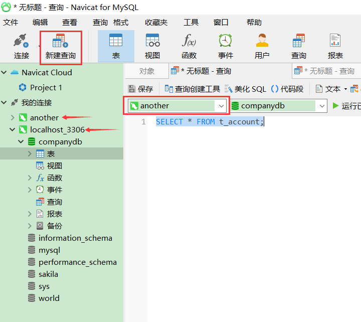

执行图中的查询语句，发现表中的数据并**没有改变**：

| account_id | money |
| ---------- | ----- |
| 1          | 5000  |
| 2          | 5000  |

这是因为在第一个连接中开启了事务，但没有提交；而在another连接中，查询语句也是一个事务（没有显式开启和显式提交），该事务只能查看其它事务修改前后者修改后的状态，此处就是只能查看转账操作提交前的状态，两个账户都是5000，这也是事务的**隔离性**。

回到localhost连接中，提交事务；然后在another连接中再查询一次：

```
COPY#localhost连接，提交事务
COMMIT;
COPY#another连接，查询表
SELECT * FROM t_account;
```

此时的查询结果如下：

| account_id | money |
| ---------- | ----- |
| 1          | 4000  |
| 2          | 6000  |

发现数据已经正式修改完毕。

回滚操作类似，但它是取消掉事务的操作，回到事务前的状态。比如事务开启后，减钱成功，但是加钱失败了（可以用SQL语句某个单词写错来模拟），然后手动执行`ROLLBACK`，减钱操作就会被撤销。不再演示。

- 此处的演示是手动进行了事物的开启和提交/回滚，在写程序时，这些操作都会在程序中进行控制。

## 十二、权限管理

## 12.1 创建用户

**语法**：`CREATE USER 用户名 IDENTIFIED BY 密码`

```
COPY#创建一个用户
CREATE USER 'client1' IDENTIFIED BY '123456'; 
```

接下来验证用户是否添加成功，首先新建连接，在用户名和账号那里写上自己创建的用户和密码，测试一下是否连接成功。

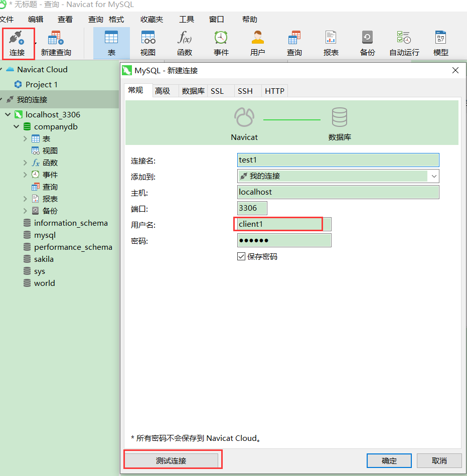

然后点“确定”。但是打开该连接之后你会发现此连接中除了一个系统数据库，其他数据库**都不存在**。这是因为client1用户建立的连接没有得到任何授权，也就是没有对数据库的访问操作权限。

## 12.2 授权

**语法**：`GRANT ALL ON 数据库.表 TO 用户名;`

```
COPY#将companydb下的所有表的权限都赋给client
GRANT ALL ON companydb.* TO client1;
```

该语句需要在root连接中执行，不能在client1连接中自己给自己授权。

## 12.3 撤销权限

**语法**：`REVOKE ALL ON 数据库.表名 FROM 用户名`

- **注意**：**撤销权限后**，**账户需要重新连接客户端才会生效**。

```
COPY#将client1的companydb的操作权限撤销
GRANT ALL ON companydb.* TO client1;
```

虽然刷新之后表不见了，但是依然可以对表进行操作，只有在重新连接数据库的时候权限才会消失。

## 12.4 删除用户

**语法**：`DROP USER 用户名`

```
COPY#删除用户client1
DROP USER 'client1';
```

# 十三、视图

------

## 13.1 概念

视图，虚拟表，从一个表或多个表中查询出来的表，作用和真实表一样，包含一系列带有行和列的数据。视图表中，用户可以使用SELECT语句查询数据，也可以使用INSERT、UPDATE、DELETE修改记录，视图可以使用户操作方便，并保障数据库系统安全。

和临时表很像，但临时表不会被保存，而视图是保存下来的表。

## 13.2 视图特点

- 优点
  - 简单化，数据所见即所得。
  - 安全性，用户只能查询或修改他们所能见到的数据。
  - 逻辑独立性，可以屏蔽真实表结构变化带来的影响。
- 缺点
  - 性能相对较差，简单的查询也会变得稍显复杂。
  - 修改不方便，特别是复杂的聚合视图基本无法修改。

## 13.3 视图的创建

**语法**：`CREATE VIEW 视图名 AS 查询数据源表结构语句;`

### 13.3.1 创建视图

```
COPY#创建t_emp_info的视图，其视图从t_employees表中查询员工编号、姓名、邮箱、工资
CREATE VIEW t_emp_info
AS
SELECT EMPLOYEE_ID,FIRST_NAME,EMAIL,SALARY FROM t_employees;
```

### 13.3.2 使用视图

```
COPY#查询t_emp_info视图中编号为036的员工信息
SELECT * FROM t_emp_info WHERE EMPLOYEE_ID = 036;
```

使用视图可以简化查询的操作，将来视图应用最多的地方也是查询。

## 13.4 视图的修改

- 方式一：`CREATE OR REPLACE VIEW 视图名 AS 查询语句`
- 方式二：`ALTER VIEW 视图名 AS 查询语句`

方式一是在不明确视图是否存在时使用，如果存在则修改，否则创建；方式二是明确存在时进行修改。无论哪种方式都需要拼接一个完整查询语句。

```
COPY#方式一，如果视图存在则修改，反之创建。
CREATE OR REPLACE VIEW t_emp_info
AS
SELECT EMPLOYEE_ID,FIRST_NAME,EMAIL,SALARY,JOB_ID FROM t_employees;
#方式二，对已存在的视图进行修改
ALTER VIEW t_emp_info
AS
SELECT EMPLOYEE_ID,FIRST_NAME,EMAIL,SALARY FROM t_employees;
```

## 13.5 视图的删除

**语法**：`DROP VIEW 视图名`

```
COPY#删除视图
DROP VIEW t_emp_info;
```

- **注意**：**删除视图不会影响原表**。

## 13.6 视图的注意事项

- 视图不会独立存储数据，原表发生改变，视图也发生改变。没有优化任何查询性能。
- 如果视图包含以下结构中的一种，则视图不可更新：
  - 聚合函数的结果
  - DISTINCT去重后的结果
  - GROUP BY分组后的结果
  - HAVING筛选过滤后的结果
  - UNION、UNION ALL联合后的结果

# 十四、SQL语言分类

------

1. **数据查询语言**DQL（Data Query Language）：SELECT、WHERE、ORDER BY、GROUP BY、HAVING；
2. **数据定义语言**DDL（Data Definition Language）：CREATE、ALTER、DROP；
3. **数据操作语言**DML（Data Manipulation Language）：INSERT、UNPATE、DELETE；
4. **事务处理语言**TPL（Transaction Process Language）：COMMIT、ROLLBACK；
5. **数据控制语言**DCL（Data Control Language）：GRANT、REVOKE。