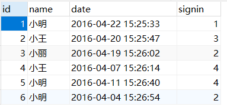
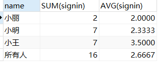
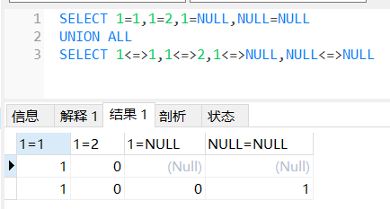

### 分组聚合

准备数据

```sql
SET NAMES utf8;
SET FOREIGN_KEY_CHECKS = 0;

-- ----------------------------
--  Table structure for `employee_tbl`
-- ----------------------------
DROP TABLE IF EXISTS `employee_tbl`;
CREATE TABLE `employee_tbl` (
  `id` int(11) NOT NULL,
  `name` char(10) NOT NULL DEFAULT '',
  `date` datetime NOT NULL,
  `signin` tinyint(4) NOT NULL DEFAULT '0' COMMENT '登录次数',
  PRIMARY KEY (`id`)
) ENGINE=InnoDB DEFAULT CHARSET=utf8;

-- ----------------------------
--  Records of `employee_tbl`
-- ----------------------------
BEGIN;
INSERT INTO `employee_tbl` VALUES ('1', '小明', '2016-04-22 15:25:33', '1'), ('2', '小王', '2016-04-20 15:25:47', '3'), ('3', '小丽', '2016-04-19 15:26:02', '2'), ('4', '小王', '2016-04-07 15:26:14', '4'), ('5', '小明', '2016-04-11 15:26:40', '4'), ('6', '小明', '2016-04-04 15:26:54', '2');
COMMIT;

SET FOREIGN_KEY_CHECKS = 1;
```



查询语句

````sql
SELECT COALESCE(`Name`,'所有人') AS name,SUM(signin),AVG(signin) FROM `employee_tbl` GROUP BY `Name` WITH ROLLUP
````



- COALESCE

依次对参数做Null判断，知道遇到并选择一个不为空的值，如`select coalesce(null,4,null,5)`结果为`4`

- WITH ROLLUP

对分组聚合统计出来的数据再做一次相同方式的聚合统计

### 等于和安全等于



| 比较  | `1` `1` | `1` `2` | `null` `1` | `null` `null` |
| ----- | ------- | ------- | ---------- | ------------- |
| `=`   | 1       | 0       | null       | null          |
| `<=>` | 1       | 0       | 0          | 1             |

