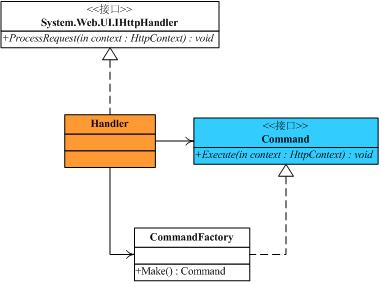
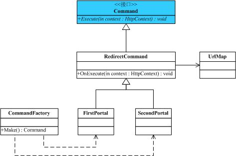

# [命令模式（Command Pattern） ](https://www.cnblogs.com/zhili/p/CommandPattern.html)

# 一、前言

　　之前一直在忙于工作上的事情，关于设计模式系列一直没更新，最近项目中发现，对于设计模式的了解是必不可少的，当然对于设计模式的应用那更是重要，可以说是否懂得应用设计模式在项目中是衡量一个程序员的技术水平，因为对于一个功能的实现，高级工程师和初级工程师一样都会实现，但是区别在于它们实现功能的可扩展和可维护性，也就是代码的是否“优美”、可读。但是，要更好地应用，首先就必须了解各种设计模式和其应用场景，所以我还是希望继续完成设计模式这个系列，希望通过这种总结的方式来加深自己设计模式的理解。

# 二、命令模式的介绍

##  2.1 命令模式的定义

命令模式属于对象的行为型模式。命令模式是把一个操作或者行为抽象为一个对象中，通过对命令的抽象化来使得发出命令的责任和执行命令的责任分隔开。命令模式的实现可以提供命令的撤销和恢复功能。

## 2.2 命令模式的结构

　　既然，命令模式是实现把发出命令的责任和执行命令的责任分割开，然而中间必须有某个对象来帮助发出命令者来传达命令，使得执行命令的接收者可以收到命令并执行命令。例如，开学了，院领导说计算机学院要进行军训，计算机学院的学生要跑1000米，院领导的话也就相当于一个命令，他不可能直接传达给到学生，他必须让教官来发出命令，并监督学生执行该命令。在这个场景中，发出命令的责任是属于学院领导，院领导充当与命令发出者的角色，执行命令的责任是属于学生，学生充当于命令接收者的角色，而教官就充当于命令的发出者或命令请求者的角色，然而命令模式的精髓就在于把每个命令抽象为对象。从而命令模式的结构如下图所示：


从命令模式的结构图可以看出，它涉及到五个角色，它们分别是：

- 客户角色：发出一个具体的命令并确定其接受者。
- 命令角色：声明了一个给所有具体命令类实现的抽象接口
- 具体命令角色：定义了一个接受者和行为的弱耦合，负责调用接受者的相应方法。
- 请求者角色：负责调用命令对象执行命令。
- 接受者角色：负责具体行为的执行。

## 2.3 命令模式的实现

　　现在，让我们以上面的军训的例子来实现一个命令模式，在实现之前，可以参考下命令模式的结构图来分析下实现过程。

　　军训场景中，具体的命令即是学生跑1000米，这里学生是命令的接收者，教官是命令的请求者，院领导是命令的发出者，即客户端角色。要实现命令模式，则必须需要一个抽象命令角色来声明约定，这里以抽象类来来表示。命令的传达流程是：

　　命令的发出者必须知道具体的命令、接受者和传达命令的请求者，对应于程序也就是在客户端角色中需要实例化三个角色的实例对象了。

　　命令的请求者负责调用命令对象的方法来保证命令的执行，对应于程序也就是请求者对象需要有命令对象的成员，并在请求者对象的方法内执行命令。

　　具体命令就是跑1000米，这自然属于学生的责任，所以是具体命令角色的成员方法，而抽象命令类定义这个命令的抽象接口。

　　有了上面的分析之后，具体命令模式的实现代码如下所示：

```c#
 1  
 2     // 教官，负责调用命令对象执行请求
 3     public class Invoke
 4     {
 5         public Command _command;
 6 
 7         public Invoke(Command command)
 8         {
 9             this._command = command;
10         }
11 
12         public void ExecuteCommand()
13         {
14             _command.Action();
15         }
16     }
17 
18     // 命令抽象类
19     public abstract class Command 
20     {
21         // 命令应该知道接收者是谁，所以有Receiver这个成员变量
22         protected Receiver _receiver;
23 
24         public Command(Receiver receiver)
25         {
26             this._receiver = receiver;
27         }
28 
29         // 命令执行方法
30         public abstract void Action();
31     }
32 
33     // 
34     public class ConcreteCommand :Command
35     {
36         public ConcreteCommand(Receiver receiver)
37             : base(receiver)
38         { 
39         }
40 
41         public override void Action()
42         {
43             // 调用接收的方法，因为执行命令的是学生
44             _receiver.Run1000Meters();
45         }
46     }
47 
48     // 命令接收者——学生
49     public class Receiver
50     {
51         public void Run1000Meters()
52         {
53             Console.WriteLine("跑1000米");
54         }
55     }
56 
57     // 院领导
58     class Program
59     {
60         static void Main(string[] args)
61         {
62             // 初始化Receiver、Invoke和Command
63             Receiver r = new Receiver();
64             Command c = new ConcreteCommand(r);
65             Invoke i = new Invoke(c);
66             
67             // 院领导发出命令
68             i.ExecuteCommand();
69         }
70     }
```

# 三、.NET中命令模式的应用(引用TerryLee)

 在ASP.NET的MVC模式中，有一种叫Front Controller的模式，它分为Handler和Command树两个部分，Handler处理所有公共的逻辑，接收HTTP Post或Get请求以及相关的参数并根据输入的参数选择正确的命令对象，然后将控制权传递到Command对象，由其完成后面的操作，这里面其实就是用到了Command模式。

 

 　　　Front Controller 的处理程序部分结构图



 

　　　　Front Controller的命令部分结构图

Handler 类负责处理各个 Web 请求，并将确定正确的 Command 对象这一职责委派给 CommandFactory 类。当 CommandFactory 返回 Command 对象后，Handler 将调用 Command 上的 Execute 方法来执行请求。具体的实现如下

```c#
  1 // Handler类
  2 public class Handler : IHttpHandler
  3 
  4 {
  5     public void ProcessRequest(HttpContext context)
  6 
  7     {
  8 
  9         Command command = CommandFactory.Make(context.Request.Params);
 10 
 11         command.Execute(context);
 12 
 13     }
 14 
 15     public bool IsReusable
 16 
 17     {
 18         get
 19 
 20         {
 21             return true;
 22         }
 23     }
 24 }
 25 
 26 Command接口：
 27 /// <summary>
 28 /// Command
 29 /// </summary>
 30 public interface Command
 31 
 32 {
 33     void Execute(HttpContext context);
 34 }
 35 
 36 CommandFactory类：
 37 /// <summary>
 38 /// CommandFactory
 39 /// </summary>
 40 public class CommandFactory
 41 
 42 {
 43     public static Command Make(NameValueCollection parms)
 44 
 45     {
 46 
 47         string requestParm = parms["requestParm"];
 48 
 49         Command command = null;
 50 
 51         //根据输入参数得到不同的Command对象
 52 
 53         switch (requestParm)
 54 
 55         {
 56             case "1":
 57 
 58                 command = new FirstPortal();
 59 
 60                 break;
 61 
 62             case "2":
 63 
 64                 command = new SecondPortal();
 65 
 66                 break;
 67 
 68             default:
 69 
 70                 command = new FirstPortal();
 71 
 72                 break;
 73         }
 74 
 75         return command;
 76 
 77     }
 78 }
 79 
 80 RedirectCommand类：
 81 public abstract class RedirectCommand : Command
 82 
 83 {
 84     //获得Web.Config中定义的key和url键值对，UrlMap类详见下载包中的代码
 85 
 86     private UrlMap map = UrlMap.SoleInstance;
 87 
 88     protected abstract void OnExecute(HttpContext context);
 89 
 90     public void Execute(HttpContext context)
 91 
 92     {
 93         OnExecute(context);
 94 
 95         //根据key和url键值对提交到具体处理的页面
 96 
 97         string url = String.Format("{0}?{1}", map.Map[context.Request.Url.AbsolutePath], context.Request.Url.Query);
 98 
 99         context.Server.Transfer(url);
100 
101     }
102 }
103 
104 FirstPortal类：
105 public class FirstPortal : RedirectCommand
106 
107 {
108     protected override void OnExecute(HttpContext context)
109 
110     {
111         //在输入参数中加入项portalId以便页面处理
112 
113         context.Items["portalId"] = "1";
114 
115     }
116 }
117 
118 SecondPortal类：
119 public class SecondPortal : RedirectCommand
120 
121 {
122     protected override void OnExecute(HttpContext context)
123 
124     {
125         context.Items["portalId"] = "2";
126     }
127 }
```

# 四、命令模式的适用场景

 　在下面的情况下可以考虑使用命令模式：

1. 系统需要支持命令的撤销（undo）。命令对象可以把状态存储起来，等到客户端需要撤销命令所产生的效果时，可以调用undo方法吧命令所产生的效果撤销掉。命令对象还可以提供redo方法，以供客户端在需要时，再重新实现命令效果。
2. 系统需要在不同的时间指定请求、将请求排队。一个命令对象和原先的请求发出者可以有不同的生命周期。意思为：原来请求的发出者可能已经不存在了，而命令对象本身可能仍是活动的。这时命令的接受者可以在本地，也可以在网络的另一个地址。命令对象可以串行地传送到接受者上去。
3. 如果一个系统要将系统中所有的数据消息更新到日志里，以便在系统崩溃时，可以根据日志里读回所有数据的更新命令，重新调用方法来一条一条地执行这些命令，从而恢复系统在崩溃前所做的数据更新。
4. 系统需要使用命令模式作为“CallBack(回调)”在面向对象系统中的替代。Callback即是先将一个方法注册上，然后再以后调用该方法。

# 五、命令模式的优缺点

 　命令模式使得命令发出的一个和接收的一方实现低耦合，从而有以下的优点：

- 命令模式使得新的命令很容易被加入到系统里。
- 可以设计一个命令队列来实现对请求的Undo和Redo操作。
- 可以较容易地将命令写入日志。
- 可以把命令对象聚合在一起，合成为合成命令。合成命令式合成模式的应用。

　　命令模式的缺点：

- 使用命令模式可能会导致系统有过多的具体命令类。这会使得命令模式在这样的系统里变得不实际。

# 六、总结

 　命令模式的实现要点在于把某个具体的命令抽象化为具体的命令类，并通过加入命令请求者角色来实现将命令发送者对命令执行者的依赖分割开，在上面军训的例子中，如果不使用命令模式的话，则命令的发送者将对命令接收者是强耦合的关系，实现代码如下：

```c#
 1  // 院领导
 2     class Program
 3     {
 4         static void Main(string[] args)
 5         {
 6            // 行为的请求者和行为的实现者之间呈现一种紧耦合关系
 7             Receiver r = new Receiver();
 8 
 9             r.Run1000Meters();
10         }
11     }
12 
13     public class Receiver
14     {
15         // 操作
16         public void Run1000Meters()
17         {
18             Console.WriteLine("跑1000米");
19         }
20     }
```

　　到这里，本章的内容就介绍结束了，在下一章将继续为大家分享下我对迭代器模式的理解。