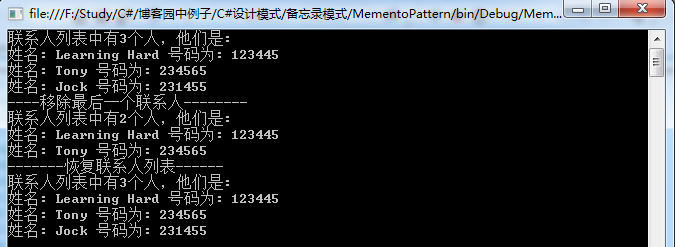
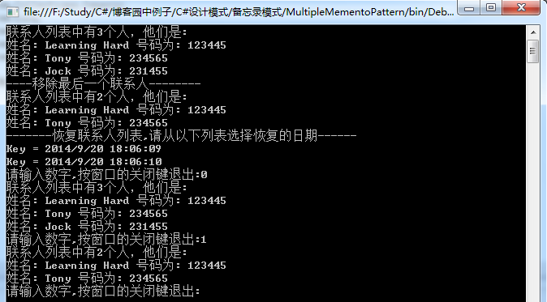

# [备忘录模式（Memento Pattern）](https://www.cnblogs.com/zhili/p/MementoPattern.html)

# 一、引言

 　在上一篇博文分享了访问者模式，访问者模式的实现是把作用于某种数据结构上的操作封装到访问者中，使得操作和数据结构隔离。而今天要介绍的备忘者模式与命令模式有点相似，不同的是，命令模式保存的是发起人的具体命令（命令对应的是行为），而备忘录模式保存的是发起人的状态（而状态对应的数据结构，如属性）。下面具体来看看备忘录模式。

# 二、备忘录模式介绍

## 2.1 备忘录模式的定义

 　从字面意思就可以明白，备忘录模式就是对某个类的状态进行保存下来，等到需要恢复的时候，可以从备忘录中进行恢复。生活中这样的例子经常看到，如备忘电话通讯录，备份操作操作系统，备份数据库等。

　　备忘录模式的具体定义是：**在不破坏封装的前提下，捕获一个对象的内部状态，并在该对象之外保存这个状态，这样以后就可以把该对象恢复到原先的状态。**

## 2.2 备忘录模式的结构图

 　介绍完备忘录模式的定义之后，下面具体看看备忘录模式的结构图：


　　备忘录模式中主要有三类角色：

- **发起人角色**：记录当前时刻的内部状态，负责创建和恢复备忘录数据。
- **备忘录角色**：负责存储发起人对象的内部状态，在进行恢复时提供给发起人需要的状态。
- **管理者角色**：负责保存备忘录对象。

## 2.3 备忘录模式的实现

 　下面以备份手机通讯录为例子来实现了备忘录模式，具体的实现代码如下所示：

```c#
 // 联系人
    public class ContactPerson
    {
        public string Name { get; set; }
        public string MobileNum { get; set; }
    }

    // 发起人
    public class MobileOwner
    {
        // 发起人需要保存的内部状态
        public List<ContactPerson> ContactPersons { get; set; }

        public MobileOwner(List<ContactPerson> persons)
        {
            ContactPersons = persons;
        }

        // 创建备忘录，将当期要保存的联系人列表导入到备忘录中 
        public ContactMemento CreateMemento()
        {
            // 这里也应该传递深拷贝，new List方式传递的是浅拷贝，
            // 因为ContactPerson类中都是string类型,所以这里new list方式对ContactPerson对象执行了深拷贝
            // 如果ContactPerson包括非string的引用类型就会有问题，所以这里也应该用序列化传递深拷贝
            return new ContactMemento(new List<ContactPerson>(this.ContactPersons));
        }

        // 将备忘录中的数据备份导入到联系人列表中
        public void RestoreMemento(ContactMemento memento)
        {
            // 下面这种方式是错误的，因为这样传递的是引用，
            // 则删除一次可以恢复，但恢复之后再删除的话就恢复不了.
            // 所以应该传递contactPersonBack的深拷贝，深拷贝可以使用序列化来完成
            this.ContactPersons = memento.contactPersonBack;
        }

        public void Show()
        {
            Console.WriteLine("联系人列表中有{0}个人，他们是:", ContactPersons.Count);
            foreach (ContactPerson p in ContactPersons)
            {
                Console.WriteLine("姓名: {0} 号码为: {1}", p.Name, p.MobileNum);
            }
        }
    }

    // 备忘录
    public class ContactMemento
    {
        // 保存发起人的内部状态
        public List<ContactPerson> contactPersonBack;

        public ContactMemento(List<ContactPerson> persons)
        {
            contactPersonBack = persons;
        }
    }

    // 管理角色
    public class Caretaker
    {
        public ContactMemento ContactM { get; set; }
    }

    class Program
    {
        static void Main(string[] args)
        {
            List<ContactPerson> persons = new List<ContactPerson>()
            {
                new ContactPerson() { Name= "Learning Hard", MobileNum = "123445"},
                new ContactPerson() { Name = "Tony", MobileNum = "234565"},
                new ContactPerson() { Name = "Jock", MobileNum = "231455"}
            };
            MobileOwner mobileOwner = new MobileOwner(persons);
            mobileOwner.Show();

            // 创建备忘录并保存备忘录对象
            Caretaker caretaker = new Caretaker();
            caretaker.ContactM = mobileOwner.CreateMemento();

            // 更改发起人联系人列表
            Console.WriteLine("----移除最后一个联系人--------");
            mobileOwner.ContactPersons.RemoveAt(2);
            mobileOwner.Show();

            // 恢复到原始状态
            Console.WriteLine("-------恢复联系人列表------");
            mobileOwner.RestoreMemento(caretaker.ContactM);
            mobileOwner.Show();

            Console.Read();
        }
    } 
```

　　具体的运行结果如下图所示：



　　从上图可以看出，刚开始通讯录中有3个联系人，然后移除以后一个后变成2个联系人了，最后恢复原来的联系人列表后，联系人列表中又恢复为3个联系人了。

　　上面代码只是保存了一个还原点，即备忘录中只保存了3个联系人的数据，但是，如果想备份多个还原点怎么办呢？即恢复到3个人后，又想恢复到前面2个人的状态，这时候可能你会想，这样没必要啊，到时候在删除不就好了。但是如果在实际应用中，可能我们发了很多时间去创建通讯录中只有2个联系人的状态，恢复到3个人的状态后，发现这个状态时错误的，还是原来2个人的状态是正确的，难道我们又去花之前的那么多时间去重复操作吗？这显然不合理，如果就思考，能不能保存多个还原点呢？**保存多个还原点其实很简单，只需要保存多个备忘录对象就可以了**。具体实现代码如下所示：

```c#
namespace MultipleMementoPattern
{
    // 联系人
    public class ContactPerson
    {
        public string Name { get; set; }
        public string MobileNum { get; set; }
    }

    // 发起人
    public class MobileOwner
    {
        public List<ContactPerson> ContactPersons { get; set; }
        public MobileOwner(List<ContactPerson> persons)
        {
            ContactPersons = persons;
        }

        // 创建备忘录，将当期要保存的联系人列表导入到备忘录中 
        public ContactMemento CreateMemento()
        {
             // 这里也应该传递深拷贝，new List方式传递的是浅拷贝，
            // 因为ContactPerson类中都是string类型,所以这里new list方式对ContactPerson对象执行了深拷贝
            // 如果ContactPerson包括非string的引用类型就会有问题，所以这里也应该用序列化传递深拷贝
            return new ContactMemento(new List<ContactPerson>(this.ContactPersons));
        }

        // 将备忘录中的数据备份导入到联系人列表中
        public void RestoreMemento(ContactMemento memento)
        {
            if (memento != null)
            {
                // 下面这种方式是错误的，因为这样传递的是引用，
                // 则删除一次可以恢复，但恢复之后再删除的话就恢复不了.
                // 所以应该传递contactPersonBack的深拷贝，深拷贝可以使用序列化来完成
                this.ContactPersons = memento.ContactPersonBack;
            }    
        }
        public void Show()
        {
            Console.WriteLine("联系人列表中有{0}个人，他们是:", ContactPersons.Count);
            foreach (ContactPerson p in ContactPersons)
            {
                Console.WriteLine("姓名: {0} 号码为: {1}", p.Name, p.MobileNum);
            }
        }
    }

    // 备忘录
    public class ContactMemento
    {
        public List<ContactPerson> ContactPersonBack {get;set;}
        public ContactMemento(List<ContactPerson> persons)
        {
            ContactPersonBack = persons;
        }
    }

    // 管理角色
    public class Caretaker
    {
        // 使用多个备忘录来存储多个备份点
        public Dictionary<string, ContactMemento> ContactMementoDic { get; set; }
        public Caretaker()
        {
            ContactMementoDic = new Dictionary<string, ContactMemento>();
        }
    }

    class Program
    {
        static void Main(string[] args)
        {
            List<ContactPerson> persons = new List<ContactPerson>()
            {
                new ContactPerson() { Name= "Learning Hard", MobileNum = "123445"},
                new ContactPerson() { Name = "Tony", MobileNum = "234565"},
                new ContactPerson() { Name = "Jock", MobileNum = "231455"}
            };

            MobileOwner mobileOwner = new MobileOwner(persons);
            mobileOwner.Show();

            // 创建备忘录并保存备忘录对象
            Caretaker caretaker = new Caretaker();
            caretaker.ContactMementoDic.Add(DateTime.Now.ToString(), mobileOwner.CreateMemento());

            // 更改发起人联系人列表
            Console.WriteLine("----移除最后一个联系人--------");
            mobileOwner.ContactPersons.RemoveAt(2);
            mobileOwner.Show();

            // 创建第二个备份
            Thread.Sleep(1000);
            caretaker.ContactMementoDic.Add(DateTime.Now.ToString(), mobileOwner.CreateMemento());

            // 恢复到原始状态
            Console.WriteLine("-------恢复联系人列表,请从以下列表选择恢复的日期------");
            var keyCollection = caretaker.ContactMementoDic.Keys;
            foreach (string k in keyCollection)
            {
                Console.WriteLine("Key = {0}", k);
            }
            while (true)
            {
                Console.Write("请输入数字,按窗口的关闭键退出:");
                
                int index = -1;
                try
                {
                    index = Int32.Parse(Console.ReadLine());
                }
                catch
                {
                    Console.WriteLine("输入的格式错误");
                    continue;
                }
                
                ContactMemento contactMentor = null;
                if (index < keyCollection.Count && caretaker.ContactMementoDic.TryGetValue(keyCollection.ElementAt(index), out contactMentor))
                {
                    mobileOwner.RestoreMemento(contactMentor);
                    mobileOwner.Show();
                }
                else
                {
                    Console.WriteLine("输入的索引大于集合长度！");
                }
            }     
        }
    }
}
```

　　这样就保存了多个状态，客户端可以选择恢复的状态点，具体运行结果如下所示：



# 三、备忘录模式的适用场景

 　在以下情况下可以考虑使用备忘录模式：

- 如果系统需要提供回滚操作时，使用备忘录模式非常合适。例如文本编辑器的Ctrl+Z撤销操作的实现，数据库中事务操作。

# 四、备忘录模式的优缺点

 　备忘录模式具有以下优点：

- 如果某个操作错误地破坏了数据的完整性，此时可以使用备忘录模式将数据恢复成原来正确的数据。
- 备份的状态数据保存在发起人角色之外，这样发起人就不需要对各个备份的状态进行管理。而是由备忘录角色进行管理，而备忘录角色又是由管理者角色管理，符合单一职责原则。

　　当然，备忘录模式也存在一定的缺点：

- 在实际的系统中，可能需要维护多个备份，需要额外的资源，这样对资源的消耗比较严重。

# 五、总结

　　备忘录模式主要思想是——利用备忘录对象来对保存发起人的内部状态，当发起人需要恢复原来状态时，再从备忘录对象中进行获取，在实际开发过程也应用到这点，例如数据库中的事务处理。