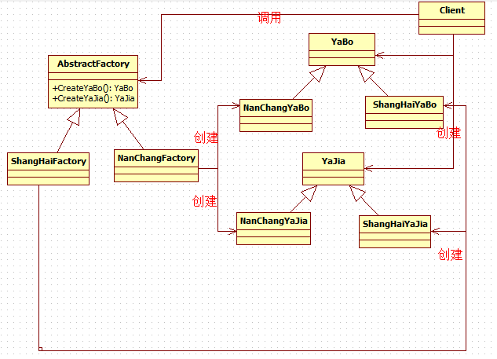

# [抽象工厂模式](https://www.cnblogs.com/zhili/p/AbstractFactory.html)

## 一、引言

在上一专题中介绍了[工厂方法模式](http://www.cnblogs.com/zhili/p/FactoryMethod.html)，工厂方法模式是为了克服简单工厂模式的缺点而设计出来的,简单工厂模式的工厂类随着产品类的增加需要增加额外的代码），而工厂方法模式每个具体工厂类只完成单个实例的创建,所以它具有很好的可扩展性。但是在现实生活中，一个工厂只创建单个产品这样的例子很少，因为现在的工厂都多元化了，一个工厂创建一系列的产品，如果我们要设计这样的系统时，工厂方法模式显然在这里不适用，然后抽象工厂模式却可以很好地解决一系列产品创建的问题,这是本专题所要介绍的内容。

## 二、抽象工厂详细介绍

这里首先以一个生活中抽象工厂的例子来实现一个抽象工厂，然后再给出抽象工厂的定义和UML图来帮助大家更好地掌握抽象工厂模式，同时大家在理解的时候，可以对照抽象工厂生活中例子的实现和它的定义来加深抽象工厂的UML图理解。

### 2.1 抽象工厂的具体实现

下面就以生活中 “**绝味**” 连锁店的例子来实现一个抽象工厂模式。例如，绝味鸭脖想在江西南昌和上海开分店，但是由于当地人的口味不一样，在南昌的所有绝味的东西会做的辣一点，而上海不喜欢吃辣的，所以上海的所有绝味的东西都不会做的像南昌的那样辣，然而这点不同导致南昌绝味工厂和上海的绝味工厂生成所有绝味的产品都不同，也就是某个具体工厂需要负责一系列产品(指的是绝味所有食物)的创建工作，下面就具体看看如何使用抽象工厂模式来实现这种情况。

```C#
  1 /// <summary>
  2     /// 下面以绝味鸭脖连锁店为例子演示下抽象工厂模式
  3     /// 因为每个地方的喜欢的口味不一样，有些地方喜欢辣点的，有些地方喜欢吃不辣点
  4     /// 客户端调用
  5     /// </summary>
  6     class Client
  7     {
  8         static void Main(string[] args)
  9         {
 10             // 南昌工厂制作南昌的鸭脖和鸭架
 11             AbstractFactory nanChangFactory = new NanChangFactory();
 12             YaBo nanChangYabo = nanChangFactory.CreateYaBo();
 13             nanChangYabo.Print();
 14             YaJia nanChangYajia= nanChangFactory.CreateYaJia();
 15             nanChangYajia.Print();
 16 
 17             // 上海工厂制作上海的鸭脖和鸭架
 18             AbstractFactory shangHaiFactory = new ShangHaiFactory();
 19             shangHaiFactory.CreateYaBo().Print();
 20             shangHaiFactory.CreateYaJia().Print();
 21 
 22             Console.Read();
 23         }
 24     }
 25 
 26     /// <summary>
 27     /// 抽象工厂类，提供创建两个不同地方的鸭架和鸭脖的接口
 28     /// </summary>
 29     public abstract class AbstractFactory
 30     {
 31         // 抽象工厂提供创建一系列产品的接口，这里作为例子，只给出了绝味中鸭脖和鸭架的创建接口
 32         public abstract YaBo CreateYaBo();
 33         public abstract YaJia CreateYaJia();
 34     }
 35 
 36     /// <summary>
 37     /// 南昌绝味工厂负责制作南昌的鸭脖和鸭架
 38     /// </summary>
 39     public class NanChangFactory : AbstractFactory
 40     {
 41         // 制作南昌鸭脖
 42         public override YaBo CreateYaBo()
 43         {
 44             return new NanChangYaBo();
 45         }
 46         // 制作南昌鸭架
 47         public override YaJia CreateYaJia()
 48         {
 49             return new NanChangYaJia();
 50         }
 51     }
 52 
 53     /// <summary>
 54     /// 上海绝味工厂负责制作上海的鸭脖和鸭架
 55     /// </summary>
 56     public class ShangHaiFactory : AbstractFactory
 57     {
 58         // 制作上海鸭脖
 59         public override YaBo CreateYaBo()
 60         {
 61             return new ShangHaiYaBo();
 62         }
 63         // 制作上海鸭架
 64         public override YaJia CreateYaJia()
 65         {
 66             return new ShangHaiYaJia();
 67         }
 68     }
 69 
 70     /// <summary>
 71     /// 鸭脖抽象类，供每个地方的鸭脖类继承
 72     /// </summary>
 73     public abstract class YaBo
 74     {
 75         /// <summary>
 76         /// 打印方法，用于输出信息
 77         /// </summary>
 78         public abstract void Print();
 79     }
 80 
 81     /// <summary>
 82     /// 鸭架抽象类，供每个地方的鸭架类继承
 83     /// </summary>
 84     public abstract class YaJia
 85     {
 86         /// <summary>
 87         /// 打印方法，用于输出信息
 88         /// </summary>
 89         public abstract void Print();
 90     }
 91 
 92     /// <summary>
 93     /// 南昌的鸭脖类，因为江西人喜欢吃辣的，所以南昌的鸭脖稍微会比上海做的辣
 94     /// </summary>
 95     public class NanChangYaBo : YaBo
 96     {
 97         public override void Print()
 98         {
 99             Console.WriteLine("南昌的鸭脖");
100         }
101     }
102 
103     /// <summary>
104     /// 上海的鸭脖没有南昌的鸭脖做的辣
105     /// </summary>
106     public class ShangHaiYaBo : YaBo
107     {
108         public override void Print()
109         {
110             Console.WriteLine("上海的鸭脖");
111         }
112     }
113 
114     /// <summary>
115     /// 南昌的鸭架
116     /// </summary>
117     public class NanChangYaJia : YaJia
118     {
119         public override void Print()
120         {
121             Console.WriteLine("南昌的鸭架子");
122         }
123     }
124 
125     /// <summary>
126     /// 上海的鸭架
127     /// </summary>
128     public class ShangHaiYaJia : YaJia
129     {
130         public override void Print()
131         {
132             Console.WriteLine("上海的鸭架子");
133         }
134     }
```

### 2.2 抽象工厂模式的定义和类图

上面代码中都有详细的注释，这里就不再解释上面的代码了，下面就具体看看抽象工厂模式的定义吧（理解定义可以参考上面的实现来加深理解）：

**抽象工厂模式：提供一个创建产品的接口来负责创建相关或依赖的对象，而不具体明确指定具体类**

抽象工厂允许客户使用抽象的接口来创建一组相关产品，而不需要知道或关心实际生产出的具体产品是什么。这样客户就可以从具体产品中被解耦。下面通过抽象工模式的类图来了解各个类中之间的关系：



### 2.3 抽象工厂应对需求变更

看完上面抽象工厂的实现之后，如果 “绝味”公司又想在湖南开一家分店怎么办呢？ 因为湖南人喜欢吃麻辣的，下面就具体看看应用了抽象工厂模式的系统是如何应对这种需求的。

```C#
 /// <summary>
    /// 如果绝味又想开一家湖南的分店时，因为湖南喜欢吃麻的
    /// 所以这是有需要有一家湖南的工厂专门制作
    /// </summary>
    public class HuNanFactory : AbstractFactory
    {
        // 制作湖南鸭脖
        public override YaBo CreateYaBo()
        {
            return new HuNanYaBo();
        }

        // 制作湖南鸭架
        public override YaJia CreateYaJia()
        {
            return new HuNanYajia();
        }
    }

    /// <summary>
    /// 湖南的鸭脖
    /// </summary>
    public class HuNanYaBo : YaBo
    {
        public override void Print()
        {
            Console.WriteLine("湖南的鸭脖");
        }
    }

    /// <summary>
    /// 湖南的鸭架
    /// </summary>
    public class HuNanYajia : YaJia
    {
        public override void Print()
        {
            Console.WriteLine("湖南的鸭架子");
        }
    }
```

此时，只需要添加三个类：一个是湖南具体工厂类，负责创建湖南口味的鸭脖和鸭架，另外两个类是具有湖南口味的鸭脖类和鸭架类。从上面代码看出，抽象工厂对于系列产品的变化支持 “开放——封闭”原则（指的是要求系统对扩展开放，对修改封闭），扩展起来非常简便，但是，抽象工厂对于添加新产品这种情况就不支持”开放——封闭 “原则，这也是抽象工厂的缺点所在，这点会在第四部分详细介绍。

## 三、抽象工厂的分析

抽象工厂模式将具体产品的创建延迟到具体工厂的子类中，这样将对象的创建封装起来，可以减少客户端与具体产品类之间的依赖，从而使系统耦合度低，这样更有利于后期的维护和扩展，这真是抽象工厂模式的优点所在，然后抽象模式同时也存在不足的地方。下面就具体看下抽象工厂的缺点（缺点其实在前面的介绍中以已经涉及了）：

**抽象工厂模式很难支持新种类产品的变化。这是因为抽象工厂接口中已经确定了可以被创建的产品集合，如果需要添加新产品，此时就必须去修改抽象工厂的接口，这样就涉及到抽象工厂类的以及所有子类的改变，这样也就违背了“开发——封闭”原则。**

知道了抽象工厂的优缺点之后，也就能很好地把握什么情况下考虑使用抽象工厂模式了，下面就具体看看使用抽象工厂模式的系统应该符合那几个前提：

- 一个系统不要求依赖产品类实例如何被创建、组合和表达的表达，这点也是所有工厂模式应用的前提。
- 这个系统有多个系列产品，而系统中只消费其中某一系列产品
- 系统要求提供一个产品类的库，所有产品以同样的接口出现，客户端不需要依赖具体实现。

## 四、.NET中抽象工厂模式实现

抽象工厂模式在实际中的应用也是相当频繁的，然而在我们.NET类库中也存在应用抽象工厂模式的类，这个类就是**System.Data.Common.DbProviderFactory**，这个类位于System.Data.dll程序集中,该类扮演抽象工厂模式中抽象工厂的角色，我们可以用reflector反编译工具查看该类的实现：

```C#
/// 扮演抽象工厂的角色
/// 创建连接数据库时所需要的对象集合，
/// 这个对象集合包括有 DbConnection对象（这个是抽象产品类,如绝味例子中的YaBo类）、DbCommand类、DbDataAdapter类，针对不同的具体工厂都需要实现该抽象类中方法，
public abstract class DbProviderFactory
{
    // 提供了创建具体产品的接口方法
    protected DbProviderFactory();
    public virtual DbCommand CreateCommand();
    public virtual DbCommandBuilder CreateCommandBuilder();
    public virtual DbConnection CreateConnection();
    public virtual DbConnectionStringBuilder CreateConnectionStringBuilder();
    public virtual DbDataAdapter CreateDataAdapter();
    public virtual DbDataSourceEnumerator CreateDataSourceEnumerator();
    public virtual DbParameter CreateParameter();
    public virtual CodeAccessPermission CreatePermission(PermissionState state);
}
```

**DbProviderFactory**类是一个抽象工厂类，该类提供了创建数据库连接时所需要的对象集合的接口，实际创建的工作在其子类工厂中进行，微软使用的是SQL Server数据库，因此提供了连接SQL Server数据的具体工厂实现，具体代码可以用反编译工具查看，具体代码如下：

```C#
/// 扮演着具体工厂的角色，用来创建连接SQL Server数据所需要的对象
public sealed class SqlClientFactory : DbProviderFactory, IServiceProvider
{
    // Fields
    public static readonly SqlClientFactory Instance = new SqlClientFactory();

   // 构造函数
    private SqlClientFactory()
    {
    }
    
   // 重写抽象工厂中的方法
    public override DbCommand CreateCommand()
    {  // 创建具体产品
        return new SqlCommand();
    }

    public override DbCommandBuilder CreateCommandBuilder()
    {
        return new SqlCommandBuilder();
    }

    public override DbConnection CreateConnection()
    {
        return new SqlConnection();
    }

    public override DbConnectionStringBuilder CreateConnectionStringBuilder()
    {
        return new SqlConnectionStringBuilder();
    }

    public override DbDataAdapter CreateDataAdapter()
    {
        return new SqlDataAdapter();
    }

    public override DbDataSourceEnumerator CreateDataSourceEnumerator()
    {
        return SqlDataSourceEnumerator.Instance;
    }

    public override DbParameter CreateParameter()
    {
        return new SqlParameter();
    }

    public override CodeAccessPermission CreatePermission(PermissionState state)
    {
        return new SqlClientPermission(state);
    }
}
```

[](javascript:void(0);)

因为微软只给出了连接SQL Server的具体工厂的实现，我们也可以自定义连接Oracle、MySql的具体工厂的实现。

## 五、总结

到这里，抽象工厂模式的介绍就结束，在下一专题就将为大家介绍建造模式。

程序源码：[抽象工厂模式实现](https://files.cnblogs.com/zhili/设计模式之抽象工厂模式.rar)