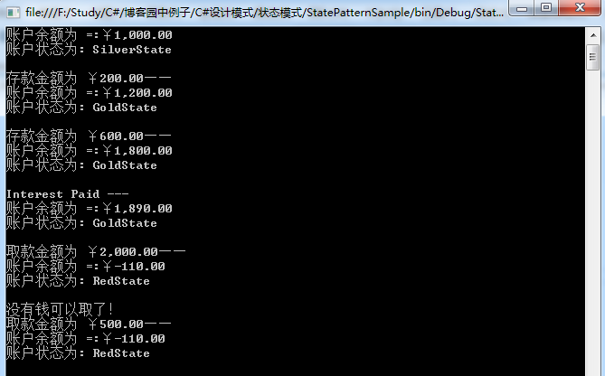

# [状态者模式（State Pattern）](https://www.cnblogs.com/zhili/p/StatePattern.html)

# 一、引言

　　在上一篇文章介绍到可以使用状态者模式和观察者模式来解决中介者模式存在的问题，在本文中将首先通过一个银行账户的例子来解释状态者模式，通过这个例子使大家可以对状态者模式有一个清楚的认识，接着，再使用状态者模式来解决上一篇文章中提出的问题。

# 二、状态者模式的介绍

　　每个对象都有其对应的状态，而每个状态又对应一些相应的行为，如果某个对象有多个状态时，那么就会对应很多的行为。那么对这些状态的判断和根据状态完成的行为，就会导致多重条件语句，并且如果添加一种新的状态时，需要更改之前现有的代码。这样的设计显然违背了开闭原则。状态模式正是用来解决这样的问题的。状态模式将每种状态对应的行为抽象出来成为单独新的对象，这样状态的变化不再依赖于对象内部的行为。

## 2.1 状态者模式的定义

　　上面对状态模式做了一个简单的介绍，这里给出状态模式的定义。

　　状态模式——允许一个对象在其内部状态改变时自动改变其行为，对象看起来就像是改变了它的类。

## 2.2 状态者模式的结构

　　既然状态者模式是对已有对象的状态进行抽象，则自然就有抽象状态者类和具体状态者类，而原来已有对象需要保存抽象状态者类的引用，通过调用抽象状态者的行为来改变已有对象的行为。经过上面的分析，状态者模式的结构图也就很容易理解了，具体结构图如下图示。

　　

　　从上图可知，状态者模式涉及以下三个角色：

- Account类：维护一个State类的一个实例，该实例标识着当前对象的状态。
- State类：抽象状态类，定义了一个具体状态类需要实现的行为约定。
- SilveStater、GoldState和RedState类：具体状态类，实现抽象状态类的每个行为。

## 2.3 状态者模式的实现

　　下面，就以银行账户的状态来实现下状态者模式。银行账户根据余额可分为RedState、SilverState和GoldState。这些状态分别代表透支账号，新开账户和标准账户。账号余额在【-100.0，0.0】范围表示处于RedState状态，账号余额在【0.0 ， 1000.0】范围表示处于SilverState，账号在【1000.0， 100000.0】范围表示处于GoldState状态。下面以这样的一个场景实现下状态者模式，具体实现代码如下所示：

```c#
namespace StatePatternSample
{
    public class Account
    {
        public State State {get;set;}
        public string Owner { get; set; }
        public Account(string owner)
        {
            this.Owner = owner;
            this.State = new SilverState(0.0, this);
        }

        public double Balance { get {return State.Balance; }} // 余额
        // 存钱
        public void Deposit(double amount)
        {
            State.Deposit(amount);
            Console.WriteLine("存款金额为 {0:C}——", amount);
            Console.WriteLine("账户余额为 =:{0:C}", this.Balance);
            Console.WriteLine("账户状态为: {0}", this.State.GetType().Name);
            Console.WriteLine();
        }

        // 取钱
        public void Withdraw(double amount)
        {
            State.Withdraw(amount);
             Console.WriteLine("取款金额为 {0:C}——",amount);
            Console.WriteLine("账户余额为 =:{0:C}", this.Balance);
            Console.WriteLine("账户状态为: {0}", this.State.GetType().Name);
            Console.WriteLine();
        }

        // 获得利息
        public void PayInterest()
        {
            State.PayInterest();
            Console.WriteLine("Interest Paid --- ");
            Console.WriteLine("账户余额为 =:{0:C}", this.Balance);
            Console.WriteLine("账户状态为: {0}", this.State.GetType().Name);
            Console.WriteLine();
        }
    }

    // 抽象状态类
    public abstract class State
    {
        // Properties
        public Account Account { get; set; }
        public double Balance { get; set; } // 余额
        public double Interest { get; set; } // 利率
        public double LowerLimit { get; set; } // 下限
        public double UpperLimit { get; set; } // 上限

        public abstract void Deposit(double amount); // 存款
        public abstract void Withdraw(double amount); // 取钱
        public abstract void PayInterest(); // 获得的利息
    }

    // Red State意味着Account透支了
    public class RedState : State
    {
        public RedState(State state)
        {
            // Initialize
            this.Balance = state.Balance;
            this.Account = state.Account;
            Interest = 0.00;
            LowerLimit = -100.00;
            UpperLimit = 0.00;
        }

        // 存款
        public override void Deposit(double amount)
        {
            Balance += amount;
            StateChangeCheck();
        }
        // 取钱
        public override void Withdraw(double amount)
        {
            Console.WriteLine("没有钱可以取了！");
        }

        public override void PayInterest()
        {
            // 没有利息
        }

        private void StateChangeCheck()
        {
            if (Balance > UpperLimit)
            {
                Account.State = new SilverState(this);
            }
        }
    }

    // Silver State意味着没有利息得
    public class SilverState :State
    {
        public SilverState(State state)
            : this(state.Balance, state.Account)
        {
        }

        public SilverState(double balance, Account account)
        {
            this.Balance = balance;
            this.Account = account;
            Interest = 0.00;
            LowerLimit = 0.00;
            UpperLimit = 1000.00;
        }

        public override void Deposit(double amount)
        {
            Balance += amount;
            StateChangeCheck();
        }
        public override void Withdraw(double amount)
        {
            Balance -= amount;
            StateChangeCheck();
        }

        public override void PayInterest()
        {
            Balance += Interest * Balance;
            StateChangeCheck();
        }

        private void StateChangeCheck()
        {
            if (Balance < LowerLimit)
            {
                Account.State = new RedState(this);
            }
            else if (Balance > UpperLimit)
            {
                Account.State = new GoldState(this);
            }
        }
    }

    // Gold State意味着有利息状态
    public class GoldState : State
    {
        public GoldState(State state)
        {
            this.Balance = state.Balance;
            this.Account = state.Account;
            Interest = 0.05;
            LowerLimit = 1000.00;
            UpperLimit = 1000000.00;
        }
        // 存钱
        public override void Deposit(double amount)
        {
            Balance += amount;
            StateChangeCheck();
        }
        // 取钱
        public override void Withdraw(double amount)
        {
            Balance -= amount;
            StateChangeCheck();
        }
        public override void PayInterest()
        {
            Balance += Interest * Balance;
            StateChangeCheck();
        }

        private void StateChangeCheck()
        {
            if (Balance < 0.0)
            {
                Account.State = new RedState(this);
            }
            else if (Balance < LowerLimit)
            {
                Account.State = new SilverState(this);
            }
        }
    }

    class App
    {
        static void Main(string[] args)
        {
            // 开一个新的账户
            Account account = new Account("Learning Hard");

            // 进行交易
            // 存钱
            account.Deposit(1000.0);
            account.Deposit(200.0);
            account.Deposit(600.0);

            // 付利息
            account.PayInterest();

            // 取钱
            account.Withdraw(2000.00);
            account.Withdraw(500.00);

            // 等待用户输入
            Console.ReadKey();
        }
    }
}
```

　　上面代码的运行结果如下图所示：



　　从上图可以发现，进行存取款交易，会影响到Account内部的状态，由于状态的改变，从而影响到Account类行为的改变，而且这些操作都是发生在运行时的。

# 三、应用状态者模式完善中介者模式方案

　　在上一篇博文中，我曾介绍到中介者模式存在的问题，详细的问题描述可以参考[上一篇博文](http://www.cnblogs.com/zhili/p/MediatorPattern.html)。下面利用观察者模式和状态者模式来完善中介者模式，具体的实现代码如下所示：

```c#
// 抽象牌友类
    public abstract class AbstractCardPartner
    {
        public int MoneyCount { get; set; }

        public AbstractCardPartner()
        {
            MoneyCount = 0;
        }

        public abstract void ChangeCount(int Count, AbstractMediator mediator);
    }

    // 牌友A类
    public class ParterA : AbstractCardPartner
    {
        // 依赖与抽象中介者对象
        public override void ChangeCount(int Count, AbstractMediator mediator)
        {
            mediator.ChangeCount(Count);
        }
    }

    // 牌友B类
    public class ParterB : AbstractCardPartner
    {
        // 依赖与抽象中介者对象
        public override void ChangeCount(int Count, AbstractMediator mediator)
        {
            mediator.ChangeCount(Count);
        }
    }

    // 抽象状态类
    public abstract class State
    {
        protected AbstractMediator meditor;
        public abstract void ChangeCount(int count);
    }

    // A赢状态类
    public class AWinState : State
    {
        public AWinState(AbstractMediator concretemediator)
        {
            this.meditor = concretemediator;
        }

        public override void ChangeCount(int count)
        {
            foreach (AbstractCardPartner p in meditor.list)
            {
                ParterA a = p as ParterA;
                //
                if (a != null)
                {
                    a.MoneyCount += count;
                }
                else
                {
                    p.MoneyCount -= count;
                }
            }
        }
    }

    // B赢状态类
    public class BWinState : State
    {
        public BWinState(AbstractMediator concretemediator)
        {
            this.meditor = concretemediator;
        }

        public override void ChangeCount(int count)
        {
            foreach (AbstractCardPartner p in meditor.list)
            {
                ParterB b = p as ParterB;
                // 如果集合对象中时B对象，则对B的钱添加
                if (b != null)
                {
                    b.MoneyCount += count;
                }
                else
                {
                    p.MoneyCount -= count;
                }
            }
        }
    }

    // 初始化状态类
    public class InitState : State
    {
        public InitState()
        {
            Console.WriteLine("游戏才刚刚开始,暂时还有玩家胜出");
        }

        public override void ChangeCount(int count)
        {
            //
            return;
        }
    }

    // 抽象中介者类
    public abstract class AbstractMediator
    {
        public List<AbstractCardPartner> list = new List<AbstractCardPartner>();

        public State State { get; set; }

        public AbstractMediator(State state)
        {
            this.State = state;
        }

        public void Enter(AbstractCardPartner partner)
        {
            list.Add(partner);
        }

        public void Exit(AbstractCardPartner partner)
        {
            list.Remove(partner);
        }

        public void ChangeCount(int count)
        {
            State.ChangeCount(count);
        }
    }

    // 具体中介者类
    public class MediatorPater : AbstractMediator
    {
        public MediatorPater(State initState)
            : base(initState)
        { }
    }

    class Program
    {
        static void Main(string[] args)
        {
            AbstractCardPartner A = new ParterA();
            AbstractCardPartner B = new ParterB();
            // 初始钱
            A.MoneyCount = 20;
            B.MoneyCount = 20;

            AbstractMediator mediator = new MediatorPater(new InitState());

            // A,B玩家进入平台进行游戏
            mediator.Enter(A);
            mediator.Enter(B);

            // A赢了
            mediator.State = new AWinState(mediator);
            mediator.ChangeCount(5);
            Console.WriteLine("A 现在的钱是：{0}", A.MoneyCount);// 应该是25
            Console.WriteLine("B 现在的钱是：{0}", B.MoneyCount); // 应该是15

            // B 赢了
            mediator.State = new BWinState(mediator);
            mediator.ChangeCount(10);
            Console.WriteLine("A 现在的钱是：{0}", A.MoneyCount);// 应该是25
            Console.WriteLine("B 现在的钱是：{0}", B.MoneyCount); // 应该是15
            Console.Read();
        }
    }
```

# 四、状态者模式的应用场景

 　在以下情况下可以考虑使用状态者模式。

- 当一个对象状态转换的条件表达式过于复杂时可以使用状态者模式。把状态的判断逻辑转移到表示不同状态的一系列类中，可以把复杂的判断逻辑简单化。
- 当一个对象行为取决于它的状态，并且它需要在运行时刻根据状态改变它的行为时，就可以考虑使用状态者模式。

# 五、状态者模式的优缺点

 　状态者模式的主要优点是：

- 将状态判断逻辑每个状态类里面，可以简化判断的逻辑。
- 当有新的状态出现时，可以通过添加新的状态类来进行扩展，扩展性好。

　　状态者模式的主要缺点是：

- 如果状态过多的话，会导致有非常多的状态类，加大了开销。

# 六、总结

　　状态者模式是对对象状态的抽象，从而把对象中对状态复杂的判断逻辑已到各个状态类里面，从而简化逻辑判断。在下一篇文章将分享我对策略模式的理解。