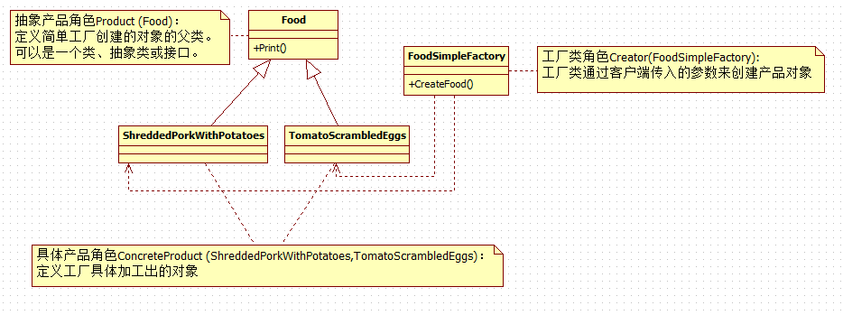
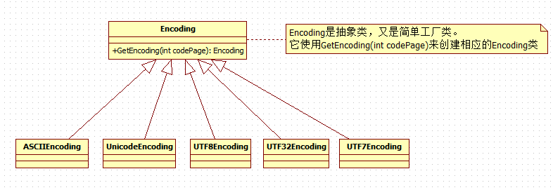

# [简单工厂模式](https://www.cnblogs.com/zhili/p/SimpleFactory.html)

## 一、引言

　　这个系列也是自己对设计模式的一些学习笔记,希望对一些初学设计模式的人有所帮助的,在上一个专题中介绍了单例模式,在这个专题中继续为大家介绍一个比较容易理解的模式——简单工厂模式。

## 二、简单工厂模式的介绍

　　说到简单工厂，自然的第一个疑问当然就是什么是简单工厂模式了？ 在现实生活中工厂是负责生产产品的,同样在设计模式中,简单工厂模式我们也可以理解为负责**生产对象的一个类,** 我们平常编程中，当使用"new"关键字创建一个对象时，此时该类就依赖与这个对象，也就是他们之间的耦合度高，当需求变化时，我们就不得不去修改此类的源码，此时我们可以运用面向对象（OO）的很重要的原则去解决这一的问题，该原则就是——**封装改变，既然要封装改变，自然也就要找到改变的代码，然后把改变的代码用类来封装**，这样的一种思路也就是我们简单工厂模式的实现方式了。下面通过一个现实生活中的例子来引出简单工厂模式。

　　在外面打工的人，免不了要经常在外面吃饭，当然我们也可以自己在家做饭吃，但是自己做饭吃麻烦，因为又要自己买菜，然而，出去吃饭就完全没有这些麻烦的，我们只需要到餐馆点菜就可以了，买菜的事情就交给餐馆做就可以了，这里餐馆就充当简单工厂的角色，下面让我们看看现实生活中的例子用代码是怎样来表现的。

自己做饭的情况：

[](javascript:void(0);)

```c#
 /// <summary>
    /// 自己做饭的情况
    /// 没有简单工厂之前，客户想吃什么菜只能自己炒的
    /// </summary>
    public class Customer
    {
        /// <summary>
        /// 烧菜方法
        /// </summary>
        /// <param name="type"></param>
        /// <returns></returns>
        public static Food Cook(string type)
        {
            Food food = null;
            // 客户A说：我想吃西红柿炒蛋怎么办？
            // 客户B说：那你就自己烧啊
            // 客户A说： 好吧，那就自己做吧
            if (type.Equals("西红柿炒蛋"))
            {
                food = new TomatoScrambledEggs();
            }
            // 我又想吃土豆肉丝, 这个还是得自己做
            // 我觉得自己做好累哦，如果能有人帮我做就好了？
            else if (type.Equals("土豆肉丝"))
            {
                food = new ShreddedPorkWithPotatoes();
            }
            return food;
        }

        static void Main(string[] args)
        {
            // 做西红柿炒蛋
            Food food1 = Cook("西红柿炒蛋");
            food1.Print();

            Food food2 = Cook("土豆肉丝");
            food2.Print();

            Console.Read();
        }
    }
 /// <summary>
    /// 菜抽象类
    /// </summary>
    public abstract class Food
    {
        // 输出点了什么菜
        public abstract void Print();
    }

    /// <summary>
    /// 西红柿炒鸡蛋这道菜
    /// </summary>
    public class TomatoScrambledEggs : Food
    {
        public override void Print()
        {
            Console.WriteLine("一份西红柿炒蛋！");
        }
    }

    /// <summary>
    /// 土豆肉丝这道菜
    /// </summary>
    public class ShreddedPorkWithPotatoes : Food
    {
        public override void Print()
        {
            Console.WriteLine("一份土豆肉丝");
        }
    }
```

[](javascript:void(0);)

　　自己做饭，如果我们想吃别的菜时，此时就需要去买这种菜和洗菜这些繁琐的操作，有了餐馆（也就是简单工厂）之后，我们就可以把这些操作交给餐馆去做，此时消费者（也就是我们）对菜（也就是具体对象）的依赖关系从直接变成的间接的，这样就是实现了面向对象的另一个原则——**降低对象之间的耦合度，**下面就具体看看有了餐馆之后的实现代码（即简单工厂的实现）：

[](javascript:void(0);)

```C#
/// <summary>
    /// 顾客充当客户端，负责调用简单工厂来生产对象
    /// 即客户点菜，厨师（相当于简单工厂）负责烧菜(生产的对象)
    /// </summary>
    class Customer
    {
        static void Main(string[] args)
        {
            // 客户想点一个西红柿炒蛋        
            Food food1 = FoodSimpleFactory.CreateFood("西红柿炒蛋");
            food1.Print();

            // 客户想点一个土豆肉丝
            Food food2 = FoodSimpleFactory.CreateFood("土豆肉丝");
            food2.Print();

            Console.Read();
        }
    }

    /// <summary>
    /// 菜抽象类
    /// </summary>
    public abstract class Food
    {
        // 输出点了什么菜
        public abstract void Print();
    }

    /// <summary>
    /// 西红柿炒鸡蛋这道菜
    /// </summary>
    public class TomatoScrambledEggs : Food
    {
        public override void Print()
        {
            Console.WriteLine("一份西红柿炒蛋！");
        }
    }

    /// <summary>
    /// 土豆肉丝这道菜
    /// </summary>
    public class ShreddedPorkWithPotatoes : Food
    {
        public override void Print()
        {
            Console.WriteLine("一份土豆肉丝");
        }
    }

    /// <summary>
    /// 简单工厂类, 负责 炒菜
    /// </summary>
    public class FoodSimpleFactory
    {
        public static Food CreateFood(string type)
        {
            Food food = null;
            if (type.Equals("土豆肉丝"))
            {
                food= new ShreddedPorkWithPotatoes();
            }
            else if (type.Equals("西红柿炒蛋"))
            {
                food= new TomatoScrambledEggs();
            }

            return food;
        }
    }
```

[](javascript:void(0);)

## 三、优点与缺点

　　看完简单工厂模式的实现之后，你和你的小伙伴们肯定会有这样的疑惑（因为我学习的时候也有）——这样我们只是把变化移到了工厂类中罢了，好像没有变化的问题，因为如果客户想吃其他菜时，此时我们**还是需要修改工厂类中的方法**（也就是多加case语句，没应用简单工厂模式之前，修改的是客户类）。我首先要说：你和你的小伙伴很对，**这个就是简单工厂模式的缺点所在**（这个缺点后面介绍的工厂方法可以很好地解决），然而，简单工厂模式与之前的实现也有它的优点：

- 简单工厂模式解决了客户端直接依赖于具体对象的问题，客户端可以消除直接创建对象的责任，而仅仅是消费产品。简单工厂模式实现了对责任的分割。
- 简单工厂模式也起到了代码复用的作用，因为之前的实现（自己做饭的情况）中，换了一个人同样要去在自己的类中实现做菜的方法，然后有了简单工厂之后，去餐馆吃饭的所有人都不用那么麻烦了，只需要负责消费就可以了。此时简单工厂的烧菜方法就让所有客户共用了。（同时这点也是简单工厂方法的缺点——因为工厂类集中了所有产品创建逻辑，一旦不能正常工作，整个系统都会受到影响，也没什么不好理解的，就如**事物都有两面性一样道理**）

虽然上面已经介绍了简单工厂模式的缺点，下面还是总结下简单工厂模式的缺点：

- 工厂类集中了所有产品创建逻辑，一旦不能正常工作，整个系统都会受到影响（通俗地意思就是：一旦餐馆没饭或者关门了，很多不愿意做饭的人就没饭吃了）
- 系统扩展困难，一旦添加新产品就不得不修改工厂逻辑，这样就会造成工厂逻辑过于复杂。

了解了简单工厂模式之后的优缺点之后，我们之后就可以知道简单工厂的应用场景了：

- 当工厂类负责创建的对象比较少时可以考虑使用简单工厂模式（）
- 客户如果只知道传入工厂类的参数，对于如何创建对象的逻辑不关心时可以考虑使用简单工厂模式

## 四、简单工厂模式UML图

简单工厂模式又叫静态方法模式（因为工厂类都定义了一个静态方法），由一个工厂类根据传入的参数决定创建出哪一种产品类的实例（通俗点表达：通过客户下的订单来负责烧那种菜）。简单工厂模式的UML图如下：



## 五、.NET中简单工厂模式的实现

　　介绍完了简单工厂模式之后，我学习的时候就像：.NET类库中是否有实现了简单工厂模式的类呢？后面确实有，.NET中[System.Text.Encoding](http://msdn.microsoft.com/zh-cn/library/system.text.encoding.aspx)类就实现了简单工厂模式，该类中的**[GetEncoding](http://msdn.microsoft.com/zh-cn/library/wzsz3bk3.aspx)(int codepage)**就是工厂方法**，**具体的代码可以通过Reflector反编译工具进行查看，下面我也贴出该方法中部分代码：

```C#
public static Encoding GetEncoding(int codepage)
{
    Encoding unicode = null;
    if (encodings != null)
    {
        unicode = (Encoding) encodings[codepage];
    }
    if (unicode == null)
    {
        object obj2;
        bool lockTaken = false;
        try
        {
            Monitor.Enter(obj2 = InternalSyncObject, ref lockTaken);
            if (encodings == null)
            {
                encodings = new Hashtable();
            }
            unicode = (Encoding) encodings[codepage];
            if (unicode != null)
            {
                return unicode;
            }
            switch (codepage)
            {
                case 0:
                    unicode = Default;
                    break;

                case 1:
                case 2:
                case 3:
                case 0x2a:
                    throw new ArgumentException(Environment.GetResourceString("Argument_CodepageNotSupported", new object[] { codepage }), "codepage");

                case 0x4b0:
                    unicode = Unicode;
                    break;

                case 0x4b1:
                    unicode = BigEndianUnicode;
                    break;

                case 0x6faf:
                    unicode = Latin1;
                    break;

                case 0xfde9:
                    unicode = UTF8;
                    break;

                case 0x4e4:
                    unicode = new SBCSCodePageEncoding(codepage);
                    break;

                case 0x4e9f:
                    unicode = ASCII;
                    break;

                default:
                    unicode = GetEncodingCodePage(codepage);
                    if (unicode == null)
                    {
                        unicode = GetEncodingRare(codepage);
                    }
                    break;
            }
            encodings.Add(codepage, unicode);
            return unicode;

        }
}
```


.NET 中Encoding的UML图为：



**Encoding**类中实现的简单工厂模式是简单工厂模式的一种演变，此时简单工厂类由抽象产品角色扮演，然而.NET中Encoding类是如何解决简单工厂模式中存在的问题的呢（即如果新添加一种编码怎么办）？在GetEncoding方法里的switch函数有如下代码：

[](javascript:void(0);)

```c#
 switch (codepage)
     {
          .......
   default:
                    unicode = GetEncodingCodePage(codepage);
                    if (unicode == null)
                    {
                        unicode = GetEncodingRare(codepage); //当编码很少见时
                    }
                    break;
           ......
      }
```

[](javascript:void(0);)

　　在GetEncodingRare方法里有一些不常用编码的实例化代码，微软正式通过这个方法来解决新增加一种编码的问题。（其实也就是列出所有可能的编码情况），微软之所以以这样的方式来解决这个问题，可能是由于现在编码已经稳定了，添加新编码的可能性比较低，所以在.NET 4.5仍然未改动这部分代码。

## 六、总结

到这里，简单工厂模式的介绍都到这里了，后面将介绍工厂方法模式来解决简单工厂模式中存在的问题。

本专题中的全部源码：[简单工厂模式源码](https://files.cnblogs.com/zhili/简单工厂模式.rar)