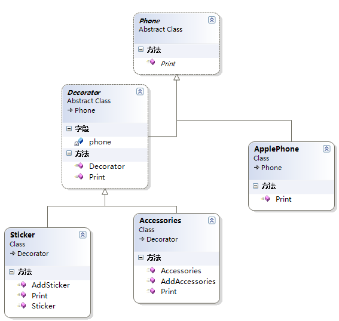
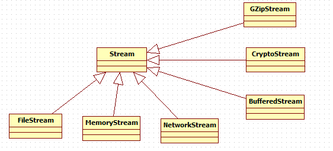

# [装饰者模式（Decorator Pattern）](https://www.cnblogs.com/zhili/p/DecoratorPattern.html)

## 一、引言

在软件开发中，我们经常想要对一类对象添加不同的功能，例如要给手机添加贴膜，手机挂件，手机外壳等，如果此时利用继承来实现的话，就需要定义无数的类，如StickerPhone（贴膜是手机类）、AccessoriesPhone（挂件手机类）等，这样就会导致 ”子类爆炸“问题，为了解决这个问题，我们可以使用**装饰者模式来动态地给一个对象添加额外的职责**。下面让我们看看装饰者模式。

## 二、装饰者模式的详细介绍

### 2.1 定义

装饰者模式以对客户透明的方式动态地给一个对象附加上更多的责任，装饰者模式相比生成子类可以更灵活地增加功能。

### 2.2 装饰者模式实现

这里以手机和手机配件的例子来演示装饰者模式的实现，具体代码如下：

```c#
/// <summary>
    /// 手机抽象类，即装饰者模式中的抽象组件类
    /// </summary>
    public abstract class Phone
    {
        public abstract void Print();
    }

    /// <summary>
    /// 苹果手机，即装饰者模式中的具体组件类
    /// </summary>
    public class ApplePhone:Phone
    {
        /// <summary>
        /// 重写基类方法
        /// </summary>
        public override void Print()
        {
            Console.WriteLine("开始执行具体的对象——苹果手机");
        }
    }

    /// <summary>
    /// 装饰抽象类,要让装饰完全取代抽象组件，所以必须继承自Photo
    /// </summary>
    public abstract class Decorator:Phone
    {
        private Phone phone;

        public Decorator(Phone p)
        {
            this.phone = p;
        }

        public override void Print()
        {
            if (phone != null)
            {
                phone.Print();
            }
        }
    }

    /// <summary>
    /// 贴膜，即具体装饰者
    /// </summary>
    public class Sticker : Decorator
    {
        public Sticker(Phone p)
            : base(p)
        { 
        }

        public override void Print()
        {
            base.Print();

            // 添加新的行为
            AddSticker();      
        }

        /// <summary>
        /// 新的行为方法
        /// </summary>
        public void AddSticker()
        {
            Console.WriteLine("现在苹果手机有贴膜了");
        }
    }

    /// <summary>
    /// 手机挂件
    /// </summary>
    public class Accessories : Decorator
    {
        public Accessories(Phone p)
            : base(p)
        {
        }

        public override void Print()
        {
            base.Print();

            // 添加新的行为
            AddAccessories();          
        }

        /// <summary>
        /// 新的行为方法
        /// </summary>
        public void AddAccessories()
        {
            Console.WriteLine("现在苹果手机有漂亮的挂件了");
        }
    }
```

此时客户端调用代码如下：

```c#
class Customer
    {
        static void Main(string[] args)
        {
            // 我买了个苹果手机
            Phone phone = new ApplePhone();

            // 现在想贴膜了
            Decorator applePhoneWithSticker = new Sticker(phone);
            // 扩展贴膜行为
            applePhoneWithSticker.Print();
            Console.WriteLine("----------------------\n");

            // 现在我想有挂件了
            Decorator applePhoneWithAccessories = new Accessories(phone);
            // 扩展手机挂件行为
            applePhoneWithAccessories.Print();
            Console.WriteLine("----------------------\n");

            // 现在我同时有贴膜和手机挂件了
            Sticker sticker = new Sticker(phone);
            Accessories applePhoneWithAccessoriesAndSticker = new Accessories(sticker);
            applePhoneWithAccessoriesAndSticker.Print();
            Console.ReadLine();
        }
```

从上面的客户端代码可以看出，客户端可以动态地将手机配件增加到手机上，如果需要添加手机外壳时，此时只需要添加一个继承Decorator的手机外壳类，从而，装饰者模式扩展性也非常好。

### 2.3 装饰者模式的类图

实现完了装饰者模式之后，让我们看看装饰者模式实现中类之间的关系，具体见下图：



在装饰者模式中各个角色有：

- 抽象构件（Phone）角色：给出一个抽象接口，以规范准备接受附加责任的对象。
- 具体构件（AppPhone）角色：定义一个将要接收附加责任的类。
- 装饰（Dicorator）角色：持有一个构件（Component）对象的实例，并定义一个与抽象构件接口一致的接口。
- 具体装饰（Sticker和Accessories）角色：负责给构件对象 ”贴上“附加的责任。

 

## 三、装饰者模式的优缺点

看完装饰者模式的详细介绍之后，我们继续分析下它的优缺点。

### 优点：

1. 装饰这模式和继承的目的都是扩展对象的功能，但装饰者模式比继承更灵活
2. 通过使用不同的具体装饰类以及这些类的排列组合，设计师可以创造出很多不同行为的组合
3. 装饰者模式有很好地可扩展性

**缺点**：装饰者模式会导致设计中出现许多小对象，如果过度使用，会让程序变的更复杂。并且更多的对象会是的差错变得困难，特别是这些对象看上去都很像。

## 四、使用场景

下面让我们看看装饰者模式具体在哪些情况下使用，在以下情况下应当使用装饰者模式：

1. 需要扩展一个类的功能或给一个类增加附加责任。
2. 需要动态地给一个对象增加功能，这些功能可以再动态地撤销。
3. 需要增加由一些基本功能的排列组合而产生的非常大量的功能

## 五、.NET中装饰者模式的实现

在.NET 类库中也有装饰者模式的实现，该类就是System.IO.Stream,下面看看Stream类结构：



上图中，BufferedStream、CryptoStream和GZipStream其实就是两个具体装饰类，这里的装饰者模式省略了抽象装饰角色（Decorator)。下面演示下客户端如何动态地为MemoryStream动态增加功能的。

```c#
 MemoryStream memoryStream = new MemoryStream(new byte[] {95,96,97,98,99});

            // 扩展缓冲的功能
            BufferedStream buffStream = new BufferedStream(memoryStream);

            // 添加加密的功能
            CryptoStream cryptoStream = new CryptoStream(memoryStream,new AesManaged().CreateEncryptor(),CryptoStreamMode.Write);
            // 添加压缩功能
            GZipStream gzipStream = new GZipStream(memoryStream, CompressionMode.Compress, true);
```

## 六、总结

到这里，装饰者模式的介绍就结束了，装饰者模式采用对象组合而非继承的方式实现了再运行时动态地扩展对象功能的能力，而且可以根据需要扩展多个功能，避免了单独使用继承带来的 ”灵活性差“和”多子类衍生问题“。同时它很好地符合面向对象设计原则中 ”优先使用对象组合而非继承“和”开放-封闭“原则。

 

本专题所有源码：[设计模式之装饰者模式](https://files.cnblogs.com/zhili/设计模式之装饰者模式.rar)