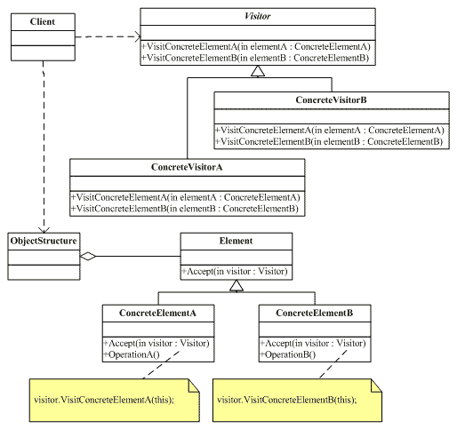

# [访问者模式（Vistor Pattern）](https://www.cnblogs.com/zhili/p/VistorPattern.html)

# 一、引言

　　在上一篇博文中分享了责任链模式，责任链模式主要应用在系统中的某些功能需要多个对象参与才能完成的场景。在这篇博文中，我将为大家分享我对访问者模式的理解。

# 二、访问者模式介绍

## 2.1 访问者模式的定义

 　访问者模式是封装一些施加于某种数据结构之上的操作。一旦这些操作需要修改的话，接受这个操作的数据结构则可以保存不变。访问者模式适用于数据结构相对稳定的系统， 它把数据结构和作用于数据结构之上的操作之间的耦合度降低，使得操作集合可以相对自由地改变。

　　数据结构的每一个节点都可以接受一个访问者的调用，此节点向访问者对象传入节点对象，而访问者对象则反过来执行节点对象的操作。这样的过程叫做“双重分派”。节点调用访问者，将它自己传入，访问者则将某算法针对此节点执行。

## 2.2 访问者模式的结构图

 　从上面描述可知，访问者模式是用来封装某种数据结构中的方法。具体封装过程是：每个元素接受一个访问者的调用，每个元素的Accept方法接受访问者对象作为参数传入，访问者对象则反过来调用元素对象的操作。具体的访问者模式结构图如下所示。



　　这里需要明确一点：访问者模式中具体访问者的数目和具体节点的数目没有任何关系。从访问者的结构图可以看出，访问者模式涉及以下几类角色。

- 抽象访问者角色（Vistor）:声明一个活多个访问操作，使得所有具体访问者必须实现的接口。
- 具体访问者角色（ConcreteVistor）：实现抽象访问者角色中所有声明的接口。
- 抽象节点角色（Element）：声明一个接受操作，接受一个访问者对象作为参数。
- 具体节点角色（ConcreteElement）：实现抽象元素所规定的接受操作。
- 结构对象角色（ObjectStructure）：节点的容器，可以包含多个不同类或接口的容器。

## 2.3 访问者模式的实现

 　在讲诉访问者模式的实现时，我想先不用访问者模式的方式来实现某个场景。具体场景是——现在我想遍历每个元素对象，然后调用每个元素对象的Print方法来打印该元素对象的信息。如果此时不采用访问者模式的话，实现这个场景再简单不过了，具体实现代码如下所示：

```c#
namespace DonotUsevistorPattern
{
    // 抽象元素角色
    public abstract class Element
    {
        public abstract void Print();
    }

    // 具体元素A
    public class ElementA : Element
    {
        public override void Print()
        {
            Console.WriteLine("我是元素A");
        }
    }

    // 具体元素B
    public class ElementB : Element
    {
        public override void Print()
        {
            Console.WriteLine("我是元素B");
        }
    }

    // 对象结构
    public class ObjectStructure
    {
        private ArrayList elements = new ArrayList();

        public ArrayList Elements
        {
            get { return elements; }
        }

        public ObjectStructure()
        {
            Random ran = new Random();
            for (int i = 0; i < 6; i++)
            {
                int ranNum = ran.Next(10);
                if (ranNum > 5)
                {
                    elements.Add(new ElementA());
                }
                else
                {
                    elements.Add(new ElementB());
                }
            }
        }
    }

    class Program
    {
        static void Main(string[] args)
        {
            ObjectStructure objectStructure = new ObjectStructure();
            // 遍历对象结构中的对象集合，访问每个元素的Print方法打印元素信息
            foreach (Element e in objectStructure.Elements)
            {
                e.Print();
            }

            Console.Read();
        }
    }
}
```

　　上面代码很准确了解决了我们刚才提出的场景，但是需求在时刻变化的，如果此时，我除了想打印元素的信息外，还想打印出元素被访问的时间，此时我们就不得不去修改每个元素的Print方法，再加入相对应的输入访问时间的输出信息。这样的设计显然不符合“开-闭”原则，即某个方法操作的改变，会使得必须去更改每个元素类。既然，这里变化的点是操作的改变，而每个元素的数据结构是不变的。所以此时就思考——能不能把操作于元素的操作和元素本身的数据结构分开呢？解开这两者的耦合度，这样如果是操作发生变化时，就不需要去更改元素本身了，但是如果是元素数据结构发现变化，例如，添加了某个字段，这样就不得不去修改元素类了。此时，我们可以使用访问者模式来解决这个问题，即把作用于具体元素的操作由访问者对象来调用。具体的实现代码如下所示：

```c#
namespace VistorPattern
{
    // 抽象元素角色
    public abstract class Element
    {
        public abstract void Accept(IVistor vistor);
        public abstract void Print();
    }

    // 具体元素A
    public class ElementA :Element
    {
        public override void Accept(IVistor vistor)
        {
            // 调用访问者visit方法
            vistor.Visit(this);
        }
        public override void Print()
        {
            Console.WriteLine("我是元素A");
        }
    }

    // 具体元素B
    public class ElementB :Element
    {
        public override void Accept(IVistor vistor)
        {
            vistor.Visit(this);
        }
        public override void Print()
        {
            Console.WriteLine("我是元素B");
        }
    }

    // 抽象访问者
    public interface IVistor
    {
        void Visit(ElementA a);
        void Visit(ElementB b);
    }

    // 具体访问者
    public class ConcreteVistor :IVistor
    {
        // visit方法而是再去调用元素的Accept方法
        public void Visit(ElementA a)
        {
            a.Print();
        }
        public void Visit(ElementB b)
        {
            b.Print();
        }
    }

    // 对象结构
    public class ObjectStructure
    {
        private ArrayList elements = new ArrayList();

        public ArrayList Elements
        {
            get { return elements; }
        }

        public ObjectStructure()
        {
            Random ran = new Random();
            for (int i = 0; i < 6; i++)
            {
                int ranNum = ran.Next(10);
                if (ranNum > 5)
                {
                    elements.Add(new ElementA());
                }
                else
                {
                    elements.Add(new ElementB());
                }
            }
        }
    }

    class Program
    {
        static void Main(string[] args)
        {
            ObjectStructure objectStructure = new ObjectStructure();
            foreach (Element e in objectStructure.Elements)
            {
                // 每个元素接受访问者访问
                e.Accept(new ConcreteVistor());
            }

            Console.Read();
        }
    }
}
```

　　从上面代码可知，使用访问者模式实现上面场景后，元素Print方法的访问封装到了访问者对象中了（我觉得可以把Print方法封装到具体访问者对象中。），此时客户端与元素的Print方法就隔离开了。此时，如果需要添加打印访问时间的需求时，此时只需要再添加一个具体的访问者类即可。此时就不需要去修改元素中的Print()方法了。

# 三、访问者模式的应用场景

 　每个设计模式都有其应当使用的情况，那让我们看看访问者模式具体应用场景。如果遇到以下场景，此时我们可以考虑使用访问者模式。

- 如果系统有比较稳定的数据结构，而又有易于变化的算法时，此时可以考虑使用访问者模式。因为访问者模式使得算法操作的添加比较容易。
- 如果一组类中，存在着相似的操作，为了避免出现大量重复的代码，可以考虑把重复的操作封装到访问者中。（当然也可以考虑使用抽象类了）
- 如果一个对象存在着一些与本身对象不相干，或关系比较弱的操作时，为了避免操作污染这个对象，则可以考虑把这些操作封装到访问者对象中。

# 四、访问者模式的优缺点 

 　访问者模式具有以下优点：

- 访问者模式使得添加新的操作变得容易。如果一些操作依赖于一个复杂的结构对象的话，那么一般而言，添加新的操作会变得很复杂。而使用访问者模式，增加新的操作就意味着添加一个新的访问者类。因此，使得添加新的操作变得容易。
- 访问者模式使得有关的行为操作集中到一个访问者对象中，而不是分散到一个个的元素类中。这点类似与"中介者模式"。
- 访问者模式可以访问属于不同的等级结构的成员对象，而迭代只能访问属于同一个等级结构的成员对象。

　　访问者模式也有如下的缺点：

- 增加新的元素类变得困难。每增加一个新的元素意味着要在抽象访问者角色中增加一个新的抽象操作，并在每一个具体访问者类中添加相应的具体操作。

# 五、总结

　　访问者模式是用来封装一些施加于某种数据结构之上的操作。它使得可以在不改变元素本身的前提下增加作用于这些元素的新操作，访问者模式的目的是把操作从数据结构中分离出来。