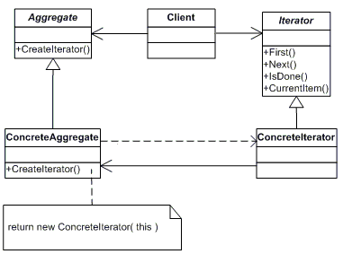
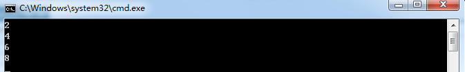

# [迭代器模式（Iterator Pattern）](https://www.cnblogs.com/zhili/p/IteratorPattern.html)

# 一、引言

　　在上篇博文中分享了我对命令模式的理解，命令模式主要是把行为进行抽象成命令，使得请求者的行为和接受者的行为形成低耦合。在一章中，将介绍一下迭代器模式。下面废话不多说了，直接进入本博文的主题。

# 二、迭代器模式的介绍

　　迭代器是针对集合对象而生的，对于集合对象而言，必然涉及到集合元素的添加删除操作，同时也肯定支持遍历集合元素的操作，我们此时可以把遍历操作也放在集合对象中，但这样的话，集合对象就承担太多的责任了，面向对象设计原则中有一条是单一职责原则，所以我们要尽可能地分离这些职责，用不同的类去承担不同的职责。迭代器模式就是用迭代器类来承担遍历集合元素的职责。

## 2.1 迭代器模式的定义

　　迭代器模式提供了一种方法顺序访问一个聚合对象（理解为集合对象）中各个元素，而又无需暴露该对象的内部表示，这样既可以做到不暴露集合的内部结构，又可让外部代码透明地访问集合内部的数据。

## 2.2 迭代器模式的结构

　　既然，迭代器模式承担了遍历集合对象的职责，则该模式自然存在2个类，一个是聚合类，一个是迭代器类。在面向对象涉及原则中还有一条是针对接口编程，所以，在迭代器模式中，抽象了2个接口，一个是聚合接口，另一个是迭代器接口，这样迭代器模式中就四个角色了，具体的类图如下所示：



　　从上图可以看出，迭代器模式由以下角色组成：

- 迭代器角色（Iterator）：迭代器角色负责定义访问和遍历元素的接口
- 具体迭代器角色（Concrete Iteraror）：具体迭代器角色实现了迭代器接口，并需要记录遍历中的当前位置。
- 聚合角色（Aggregate）：聚合角色负责定义获得迭代器角色的接口
- 具体聚合角色（Concrete Aggregate）：具体聚合角色实现聚合角色接口。

## 2.3 迭代器模式的实现

　　介绍完迭代器模式之后，下面就具体看看迭代器模式的实现，具体实现代码如下：

```c#
  1  // 抽象聚合类
  2     public interface IListCollection
  3     {
  4         Iterator GetIterator();
  5     }
  6 
  7     // 迭代器抽象类
  8     public interface Iterator
  9     {
 10         bool MoveNext();
 11         Object GetCurrent();
 12         void Next();
 13         void Reset();
 14     }
 15 
 16     // 具体聚合类
 17     public class ConcreteList : IListCollection
 18     {
 19         int[] collection;
 20         public ConcreteList()
 21         {
 22             collection = new int[] { 2, 4, 6, 8 };
 23         }
 24 
 25         public Iterator GetIterator()
 26         {
 27             return new ConcreteIterator(this);
 28         }
 29 
 30         public int Length
 31         {
 32             get { return collection.Length; }
 33         }
 34 
 35         public int GetElement(int index)
 36         {
 37             return collection[index];
 38         }
 39     }
 40 
 41     // 具体迭代器类
 42     public class ConcreteIterator : Iterator
 43     {
 44         // 迭代器要集合对象进行遍历操作，自然就需要引用集合对象
 45         private ConcreteList _list;
 46         private int _index;
 47 
 48         public ConcreteIterator(ConcreteList list)
 49         {
 50             _list = list;
 51             _index = 0;
 52         }
 53 
 54 
 55         public bool MoveNext()
 56         {
 57             if (_index < _list.Length)
 58             {
 59                 return true;
 60             }
 61             return false;
 62         }
 63 
 64         public Object GetCurrent()
 65         {
 66             return _list.GetElement(_index);
 67         }
 68 
 69         public void Reset()
 70         {
 71             _index = 0;
 72         }
 73 
 74         public void Next()
 75         {
 76             if (_index < _list.Length)
 77             {
 78                 _index++;
 79             }
 80                 
 81         }
 82     }
 83 
 84     // 客户端
 85     class Program
 86     {
 87         static void Main(string[] args)
 88         {
 89             Iterator iterator;
 90             IListCollection list = new ConcreteList();
 91             iterator = list.GetIterator();
 92 
 93             while (iterator.MoveNext())
 94             {
 95                 int i = (int)iterator.GetCurrent();
 96                 Console.WriteLine(i.ToString());
 97                 iterator.Next();
 98             }
 99 
100             Console.Read();
101         }
102     }
```

自然，上面代码的运行结果也是对集合每个元素的输出，具体运行结果如下图所示：



# 三、.NET中迭代器模式的应用

　　在.NET下，迭代器模式中的聚集接口和迭代器接口都已经存在了，其中IEnumerator接口扮演的就是迭代器角色，IEnumberable接口则扮演的就是抽象聚集的角色，只有一个GetEnumerator()方法，关于这两个接口的定义可以自行参考MSDN。在.NET 1.0中，.NET 类库中很多集合都已经实现了迭代器模式，大家可以用反编译工具Reflector来查看下mscorlib程序集下的System.Collections命名空间下的类，这里给出ArrayList的定义代码，具体实现代码可以自行用反编译工具查看，具体代码如下所示：

```c#
 1 public class ArrayList : IList, ICollection, IEnumerable, ICloneable
 2 {
 3     // Fields
 4     private const int _defaultCapacity = 4;
 5     private object[] _items;
 6     private int _size;
 7     [NonSerialized]
 8     private object _syncRoot;
 9     private int _version;
10     private static readonly object[] emptyArray;
11 
12     public virtual IEnumerator GetEnumerator();
13     public virtual IEnumerator GetEnumerator(int index, int count);
14 
15     // Properties
16     public virtual int Capacity { get; set; }
17     public virtual int Count { get; }
18     ..............// 更多代码请自行用反编译工具Reflector查看
19 }
```

　　通过查看源码你可以发现，ArrayList中迭代器的实现与我们前面给出的示例代码非常相似。然而，在.NET 2.0中，由于有了yield return关键字，实现迭代器模式就更简单了，关于迭代器的更多内容可以参考我的[这篇博文](http://www.cnblogs.com/zhili/archive/2012/12/02/Interator.html)。

# 四、迭代器模式的适用场景

　　在下面的情况下可以考虑使用迭代器模式：

- 系统需要访问一个聚合对象的内容而无需暴露它的内部表示。
- 系统需要支持对聚合对象的多种遍历。
- 系统需要为不同的聚合结构提供一个统一的接口。

# 五、迭代器模式的优缺点

　　由于迭代器承担了遍历集合的职责，从而有以下的优点：

- 迭代器模式使得访问一个聚合对象的内容而无需暴露它的内部表示，即迭代抽象。
- 迭代器模式为遍历不同的集合结构提供了一个统一的接口，从而支持同样的算法在不同的集合结构上进行操作

　　迭代器模式存在的缺陷：

- 迭代器模式在遍历的同时更改迭代器所在的集合结构会导致出现异常。所以使用foreach语句只能在对集合进行遍历，不能在遍历的同时更改集合中的元素。

# 六、总结

　　到这里，本博文的内容就介绍结束了，迭代器模式就是抽象一个迭代器类来分离了集合对象的遍历行为，这样既可以做到不暴露集合的内部结构，又可让外部代码透明地访问集合内部的数据。在一篇博文中将为大家介绍观察者模式。